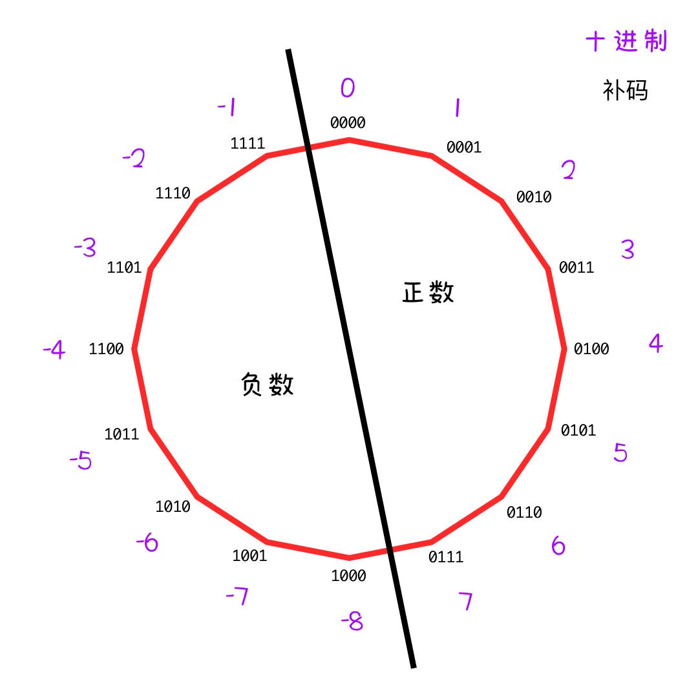
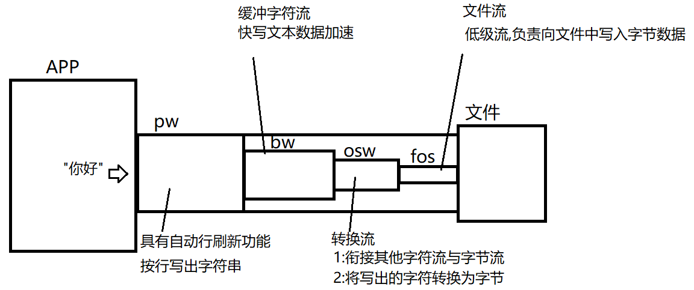

这个文件专门用来记录达内Java就业班的学习笔记。捡着重要的记。


## 01 Fundamental——Java语言基础

### day01 Java语言介绍和开发环境搭建

#### 一、Java语言特性(了解即可)

1. **面向对象**： 类、对象、接口、封装、继承、多态。
2. **平台无关性**：一次编写，到处运行。不同平台上有不同的JVM。
3. **简单性**：语法简单。没有指针。有垃圾回收。学起来简单，用起来简单。
4. **解释执行**：源代码编译成字节码，然后解释器对字节码进行解释，最后再执行。
5. **多线程**：Java 是支持多个线程同时执行的，并且提供了多个线程之间的同步机制。
6. **分布式**：可以把一个软件根据功能拆分到不同的服务器上，然后通过网络连接把这些功能集合起来。Java 支持各种层次的网络连接，常见的 API 比如说 Socket。
7. **健壮性**：Java 的强类型、异常处理和垃圾回收机制，保证了 Java 的健壮性。
8. **高性能**：Java 不断进行性能优化升级，运行速度还是比较快的。
9. **安全性**：Java 提供了很多的安全防范机制，尤其是针对网络安全这一块。


#### 二、开发环境介绍与搭建

##### 开发环境相关术语介绍

###### JVM、JRE与JDK 

- **JVM**：**J**ava **V**irtual **M**achine， Java 虚拟机，作用是加载和运行字节码文件。
- **JRE**：**J**ava **R**untime **E**nvironment，Java 运行时环境，JRE = JVM虚拟机 + 系统类库，**运行** Java 程序的最小单元。
- **JDK**：**J**ava **D**evelopment **K**it，Java 开发工具箱， JDK = JRE + 编译运行等工具，**开发** Java 程序的最小单元。

###### Java编译运行的过程

1. 编译期：javac 把`.java`源代码文件编译成`.class`字节码文件。
2. 运行期：JVM加载并运行字节码文件。

###### IDE（集成开发环境）

（Integrated Development Environment)，把开发所需要用的的各种工具，都给你集中到一个软件里了。Java常用的IDE有eclipse和idea等。

###### 基本的代码组织形式

- **Project**：项目
- **package**：包
- **class**：类

##### 安装JDK和IDEA

不赘述了，都会。

##### 第一行代码：hello world

1. 新建项目 **Fundamental01**
2. 新建包 **day01**
3. 新建类 **HelloWorld.java** 代码如下：

```java
package day01;

public class HelloWorld {
//    主方法，程序的入口。程序的执行，从main开始
    public static void main(String[] args) {
//        输出hello world
        System.out.println("hello, world");
//        严格区分大小写
//        所有符号必须是英文的
//        每句话必须以分号结尾
    }
}
```

> 说明： - main 方法为程序的主入口，从main 开始，从 main 结束。 - 一条 Java 语句要以分号结束。 - System.out.println() 向控制台换行输出语句。 - 字符串表示文字信息，用`""`围起来。

##### 注释

注释是解释性文本，编译器编译时会自动忽略。

- 单行注释：`// balabala`
- 多行注释：

```java
/* 一行
 * 两行
 */
```

​	多行注释中间的内容会被忽略掉，可以用在一行的中间。

```java
// 系统出题
int num1 = getRandomInt();
int num2 = getRandomInt();
int answer = num1 + num2;

String questionText = "Question" + i + ": " + num1 + " + " + num2 + " = ?"/*+ answer*/;
```


- 文档注释：

```java
/**
 * 这个类演示了文档注释
 * @author yuyu
 * @version 1.1
 */
```


### day02 变量和基本数据类型及类型转化

#### 一、变量

**变量**是用来存储数据的。

##### 变量的声明

```java
int a; // 声明了一个整型类型的变量，名为 a
```

##### 变量的初始化

初始化，就是第一次赋值。

```java
int a = 1; // 声明了一个整型变量，并初始化为1
```

##### 变量的使用

对变量的使用就是对它所存的那个数的使用。

```java
int a = 5;
int b = a + 10; // 把 a 的值取出来，加上5，赋值给 b.
System.out.println(b); // 把 b 的值输出到控制台
```

使用变量时，要注意数据类型必须匹配。

```java
int a = 3.14; // 编译错误，数据类型不匹配。
```

变量在使用之前，必须先声明和初始化。

```java
System.out.println(m); // 编译错误，变量未声明

int n;
System.out.println(n); // 编译错误，变量未初始化
```

```java
// 3)使用：使用的是账户里面的钱
int g = 5;
int h = g + 10; //取出g的值5, 把它加上10，然后把结果赋给h
System.out.println(h); // 输出变量h的值
System.out.println("h"); //输出字符串h
g = g + 10; // g在本身基础上，增加10
System.out.println(g);

//        System.out.println(i); // 编译错误，cannot resolve symbol 'i',无法解析符号
int i;
//        System.out.println(i); // variable 'i' might have not been initialized,变量i可能还未被初始化

```


##### 变量的命名规则

**硬规则**：

- 只能包含字母、数字、`_`和`$`，且不能以数字开头（数字开头会被看成字面量）。
- 严格区分大小写。
- 不能使用关键字及Java保留字。

**建议**：

- 不建议使用中文命名变量，虽然是可行的
- 变量名要表述清楚变量存放的是什么。
- 推荐使用驼峰命名法

##### 介绍两种命名法

- **驼峰命名法**：第一个单词的首字母小写，之后的单词首字母大写。一般用于命名**变量**。如`score`,`myScore`,`myJavaScore`等。
- **帕斯卡命名法**：每个单词的首字母大写。一般用于命名**类**。如`Car`,`BigCar`,`BlueBigCar`等。

```java
// 4)命名：
int a1, a_5$, _3c, $y;
//        int 1a; //1看成字面量

int 年龄; //不建议 Non-ASCII characters
int nianLing; //不建议，既不专业，又不直观
int age; // 建议"英文的见名知意"
int score, myScore, myJavaScore; // 小驼峰命名法
```


#### 二、Java语言中的基本数据类型

Java 中有 8 中基本数据类型，分别是：**byte、short、int、long, float、double, boolean, char**。

其中 **byte short int long float double** 是数字类型。

- **byte short int long** 代表的是整数
- **float double** 表示浮点数，也就是小数。

> 所有变量/数据——都会存储在内存中，内存是有大小的。
>
> 变量到底占用多大的内存，是由它的数据类型所决定的。
>
> ```
> int a = 5;  //a在内存中占4个字节
> int b = 100000000; //b在内存中也占4个字节
> ```


> 1G = 1024M(兆) 	1M=1024KB(千字节)	1KB = 1024B(字节) 	1B=8Bit(位)


###### int 类型

**int**：整型，**4** 个字节，-21亿到21亿

- 整数字面量默认为`int`类型，但不能超出范围，如超出范围，会发生编译错误
- int 数据类型无法表示小数，所以 5/2 = 2。两个整数相除，结果还是整数，**小数位无条件舍弃**（不会四舍五入）
- 整数运算时，若超出范围，会发生溢出（溢出不会报错，但还是要避免的）。溢出实际上从最大值转圈，转到了最大值。

```java
public static void main(String[] args) {
    // 1) int: 整型，4个字节，-21亿到21亿左右
    int a = 250;
//        int b = 100000000000; // 字面量默认是int类型，但100000000000超出了int所能表示的范围。
    System.out.println(5/2); // int 数据无法表示小数，所以 5/2 = 2
    System.out.println(2/5); // 同样 2/5 = 0
    System.out.println(5.0/2); //5.0是double类型的字面量

    int c = 2147483647; // int的最大值
    c = c + 1; //发生溢出
    System.out.println(c); // -2147483648


}
```


###### long 类型

**long**：长整型，8个字节，可表示整数的范围很大。

- 长整型直接量需要在数字后加`L`；直接写整数，是int的字面量，而10_000_000_000太大了。*integer number too large.*
- 不同数据类型计算，结算结果的类型，以大的为准。
- 整数运算时若有可能发生溢出，建议在第一个数字后加`L`.

```java
public static void main(String[] args) {
    // 2) long:长整型，8个字节，可表示整数的范围很大
//        long a = 10_000_000_000; // 直接写整数，是int的字面量，而10_000_000_000太大了。integer number too large.
    // 长整型直接量需要在数字后加`L`
    long b = 10_000_000_000L;
    // 不同数据类型计算，结算结果的类型，以大的为准。
    long c = 100_000_000 * 2 * 10L; // 注意到c的数据类型为long, c的数值为20亿
    System.out.println(c);

    long d = 1_000_000_000*3*10L; // 10亿*3*10,结果为三百亿，但10亿*3的时候就已经发生了溢出。
    System.out.println(d);
    long e = 1_000_000_000L*3*10; // 如果在第一个因数就标明L, 则在long的范围内计算，不会发生溢出。
    System.out.println(e);


}
```


###### float double 浮点类型

本质：**企图用密集的有间隔的点代表连续不断的实心的线**。

**double**:浮点型,8个字节，可以表示小数，表示数的范围很广，比**float**类型(4字节)更精确。

- **浮点型直接量**默认为 **double 类型**，float 字面量是在数字后加`f`.
- **浮点型的舍入误差**：double 以及 float型数据参与运算时，有可能会发生舍入误差。（精确场合不能使用）

```java
public static void main(String[] args) {
    // 3)double:浮点型,8个字节，可以表示小数，表示数的范围很广，比float更精确。
    // 浮点型直接量默认为 double 类型
    double a = 3.25;
    float b = 3.25f;
    // 浮点型的舍入误差
    double c = 3.0, d = 2.9;
    System.out.println(c-d); //0.10000000000000009

    c = 6.0;
    d = 4.9;
    System.out.println(c-d);
}
```


###### boolean 类型

**boolean**：用来标明真假，占 1 个字节。

- **只能赋值为 `true` 或 `false`**

###### char 类型

**char**：字符，2 个字节。

- 采用 Unicode 字符集编码，每个字符都有一个对应的码。
- 表现形式是字符 **char**，本质上是码 **int**（0 到 65535）
- **字符类型字面量，用单引号标记**。单引号里面(双引号不行)，只能有**一个**字符(0个字符，多个字符都不行)。
- 特殊字符需要用`\`转义
- **ASCII** 码（**'a'-97, 'A'-65, '0'-48**)

##### Unicode 编码

- **Unicode**：万国码、统一码、通用码，是世界级通用的定长(16bit)字符集。
- Java中的`char`采用的是 Unicode 字符集中最常用的一组编码，共 **65535** 个。

```java
public static void main(String[] args) {
    //4)boolean: 布尔型，1个字节
    boolean a = true;
    boolean b = false;
//        boolean c = 0; //布尔类型变量，只能存储true或false

    //5)char:字符型，2个字节
    char c1 = '女';
    char c2 = 'f';
    char c3 = '6';
    char c4 = '*';

    // 几个错误示例
//        char c5 = 女;   //字符字面量必须放在单引号中
//        char c6 = "女"; //双引号也不行
//        char c7 = '';   //必须有字符
//        char c8 = '女性'; //必须只有一个字面量

    char c9 = '\\';
    System.out.println(c9);

    char c10 = 65;
    System.out.println(c10); // 输出时会依据变量的数据类型来输出。
}
```


#### 三、类型间的转换

##### 两种类型转换方式

- **隐式自动**类型转换：小类型自动转换为大类型。

- **显式强制**类型转换：大类型强制转换到小类型，可能会发生溢出和精度丢失的问题。

  - ```java
     // 类型间的转换
     int a = 5;
     long b = a;  //自动类型转换
     int c = (int) b; //强制类型转换
	    
     long d = 25;  //自动类型转化
     double e = 25; //自动类型转化
     System.out.println(d);
     System.out.println(e);
    ```
  - ```java
     // 范围大的类型强转范围小的类型，有可能发生溢出
     long f = 10_000_000_000L;
     int g = (int)f;
     System.out.println(g); //1410065408
      
     // 精度高的类型强转精度小的类型，有可能精度丢失
     double h = 25.987878745847583753985738538843457348573485345;
     int i = (int)h;
     System.out.println(i); //25
     float j = (float)h;
     System.out.println(j); //25.987879
    ```


##### 两点规则

1.  **可表示范围内**，直接量可以直接赋值给**byte**,**short**, **int**, **long**, **char**。
2. **byte, short, char** 型数据参与运算时，一律**先转换为 int类型**，之后再做运算。

```java
public static void main(String[] args) {
    // 可表示范围内，直接量可以直接赋值给byte,short, int, long, char
    byte b1 = 5;

    // byte, short, char型数据参与运算时，一律先转换为int类型，之后再做运算.
    byte b2 = 6;
//        byte b3 = b1 + b2; //会报错，因为右边计算的结果是int类型。需强转。
//        byte b3 = (byte)b1 + (byte)b2; //这也错，需要用小括号，改变运算优先级。
    byte b3 = (byte) (b1 + b2);
}

  // 以下都是先转为int,然后再参与计算
    System.out.println(2+2);
    System.out.println(2+'2'); // '2' => char类型的字面量，对应int值为50
    System.out.println('2'+'2'); // 50 + 50 => 100

}
```


### day03 运算符和表达式、分支结构

#### 一、运算符

##### 1. 算术运算符

算术运算符有两类，一类是**加减乘除、取余**，一类是**自增减运算符**。运算结果是数值。

###### + - * / %：

加减乘除很熟悉了。**%**:取模/取余，取计算结果的余数。

###### ++和--

自身增加或减少1，可以用在变量前，或变量后。

单独增减时，前置后置没有区别。被引用时：

- **前置**：先自增减，返回增减后的值

- **后置**：先返回原来的值，后自增减

```java
 /*
1. 算术运算符：+, -, *, /, %
 1)%:取模/取余，取计算结果的余数
 */
System.out.println(5%2); // 商2余1
System.out.println(8%2); // 商4余0 ——整除
System.out.println(2%5); // 商0余2


/*
 2)自增减运算符
 */
int a = 5, b = 5;
int c = a++; // c = 5, a = a + 1;
int d = ++b; // ++b , b = 6; d = b = 6;

System.out.println(a); //6
System.out.println(b); //6
System.out.println(c); //5
System.out.println(d); //6

```


##### 2. 关系运算符

关系运算符，进行大小相等关系的判断，有`>`  `<`   `=`   `!=`  `>=`  `<=`，返回布尔值`true`或`false`。

```java
 /*
 3)关系运算符
 */
  int a = 5, b = 10, c = 5;
  boolean b1 = a > b;
  System.out.println(b1);         // false
  System.out.println(a % 2 == 0); // false
  System.out.println(c++==5);     // true

```


##### 3. 逻辑运算符

逻辑运算符，进行**或且非**的逻辑运算，返回布尔值`true`或`false`。

###### 与 `&&`

两边都为 `true`，结果为 `true`. 只要有一个`false`，则结果为`false`.

###### 或 `||`

有一个为 `true`，结果为 `true`.只要有一个`true`，则结果为`true`.

###### 非 `！`

`true` 变成`false`，`false`变成`true`.

```java
/*
 3)逻辑运算符
 */
int a = 5, b = 10, c = 5;

// && 且 有false则false
boolean b1 = b >= a && b < c; // true && false => false
System.out.println(b1);         //
System.out.println(b <= c && b > a); // false && true => false
System.out.println(a == b && c > b); // false && false => false
System.out.println(a != c && a < b); // true && true => true

// || 或 有true则true
System.out.println(1<2 || 2<3); // true || true => true
System.out.println(1<2 || 3>2); // true || false => true
System.out.println(1>2 || 2<3); // false || true => true
System.out.println(1>2 || 2>3); // false || false => false


// ! 非 true变false, false变true
System.out.println("----!-----");
System.out.println(!true);  // false
System.out.println(!false); // true
```


###### 逻辑运算符的短路特性

与 `&&`运算，前边一个条件判断为`false`,后面条件不需判断，则发生短路运算，后边语句不会执行。

或 `||`运算，前面一个条件判断为`true`，后面条件不需判断，语句也不会执行。

```java
 /*
 逻辑运算符的短路特性
 */
System.out.println("逻辑运算符的短路特性:");
int j = 0 , k = 0;
boolean b2 = j > k && j++ > k;
System.out.println("j:"+j); // j:0, 前一个语句 j > k 为false, 后面 j++>k 未执行
System.out.println("k:"+k); // k:0
System.out.println(b2);
System.out.println();
boolean b3 = j == k && j++ > k; // 0==0 -> true; 0>0 -> false; true && false -> false;
System.out.println("j:"+j); // j:1, 前一个条件为true, 后面语句j++>k才执行了
System.out.println("k:"+k);
System.out.println(b3);  // false 有趣
System.out.println();

int m = 0, n = 0;
boolean l = m == n || m++ == n; // 0==0, true; m++ 不会执行
System.out.println("m:"+m); //m:0
System.out.println("n:"+n); //n:0

boolean l2 = m > n || m++ == n; // 0>0, false; m++ == n, 会执行, m++ 的值为0, 后m的值自增为1, n为0.
// 0 == 0, true; false || true , 结果为 true.
```


##### 4. 赋值运算符

###### 简单赋值运算符

​	`=` ：把右边的值赋给左边。

###### 复合赋值运算符

​	复合赋值运算符，把**算术运算**和**赋值**这两个操作复合起来的运算符。 像`a = a + 10;`这种先进行**算术运算**，再将**运算结果赋值给自身**的语句，就可以简写为：`a += 10;`。复合赋值运算符有`+=` `-=` `*=` `/=` `%=` 等。原理都是一样的。

```java
/*
4)赋值运算符
*/

// 复合赋值运算符 a += 10; 相当于 a = a + 10;
int a = 5;
a += 10;
System.out.println(a); //15
a *= 2;
System.out.println(a); //30
```

需要注意的是，复合赋值运算符**自带强转功能**。

```java
short s = 5; // 整数字面量可以直接给 short 赋值
s += 10;     // 复合赋值运算符，自带强转。
//s = s + 10;  // short 进行计算时，先转成int,再参与计算。 计算结果是int型，而s是short型。
s = (short)(s + 10);
```

所以`a += 10;`相当于`a = (目标类型) (a + 10);`,附带强转的功能。


##### 5. 字符串连接符

`+`除了用来做**加法运算**，还可以用来**拼接字符串**的。

```java
int age = 18;
System.out.println("age="+age);
System.out.println("我今年"+age+"岁了");

String name = "Ming";
System.out.println("Hello!My name is "+name+" and I'm " + age + " years old.");
        
```

```
age=18
我今年18岁了
Hello!My name is Ming and I'm 18 years old.
```

字符串的同化作用：字符串对`+`说：听我的！你是我的拼接符！

```java
// 字符串的同化作用
System.out.println(20+20+""+30); //4030
System.out.println(""+10+20+30); //102030
System.out.println(10+20+30+""); //60
```


##### 6. 三目运算符

格式： `条件` ? `条件为true时的值` : `条件为false时的取值`

示例：

```java
int num1 = 8, num2 = 5;
int max = num1 > num2 ? num1 : num2;
System.out.println(max); //8
```


#### 二、分支结构

> 三大控制流：顺序分支循环。

###### 程序流程结构

- 顺序结构：从上到下，逐行执行每个语句。
- 分支结构：根据条件，执行相应语句。
- 循环结构：有条件地多次执行语句。

###### if结构

**语法**：

```java
if (boolean) {
  code blocks…… 基于条件执行的语句
}
```

**执行过程**：

判断括号内表达式的值。

- 若为`true`,则执行语句块。

- 若为`false`,则结束if结构。

**代码示例**：

 ```java
         // 偶数的判断
         int num = 6;
         if (num % 2 == 0) {
             System.out.println(num+"是偶数");
         }
         System.out.println("over");
 
         // 满500打8折纸
         double price = 500;
         if (price >= 500) {
             price *= 0.8;
         }
         System.out.println("最终结算金额为：" + price);
 ```

###### if-else结构

**语法**：

```java
if (boolean) {
  // 条件为true，则执行这里的语句块
} else {
  // 条件为false，则执行这里的语句块
}
```

**执行过程**：

判断括号内表达式的值。

- 若为`true`,则执行if后的语句块。

- 若为`false`,则执行else后的语句块。

**代码示例**：

```java
int num = 9;
if (num % 2 == 0) {
    System.out.println(num+"是偶数");
} else {
    System.out.println(num+"是奇数");
}
System.out.println("over");
```


### day04 分支结构(续)、循环结构

#### 一、Scanner的使用

**Scanner**是Java提供的一个工具，可以接受用户输入的数据。

使用**Scanner**的步骤:

	1. 导包
	1. 实例化一个 scanner 对象。
	1. 调用方法，扫描用户输入。

```java
package day04;
import java.util.Scanner;

public class ScannerDemo {
    public static void main(String[] args) {
        Scanner scan = new Scanner(System.in);
        System.out.println("请输入年龄：");
        int age = scan.nextInt();
        System.out.println("年龄为:"+age);
        System.out.println("请输入商品价格：");
        double price = scan.nextDouble();
        System.out.println("商品价格为："+price);
    }
}
```


#### 二、分支结构(续)

##### if - else if - else结构

**语法**：

```java
if (boolean1) {
  
} else if(boolean2){
	
} else if(boolean3){
  
}
```

**执行过程**：

- 先判单`boolean1`,若为`true`,则执行if后的语句块，然后结束分支结构。

- 若`boolean1`为`false`,则判断`boolean2`,`boolean2`为`true`则执行其后面的语句块。否则继续判断`boolean3`，以此类推。

**代码示例**：

```java
  Scanner scanner = new Scanner(System.in);
  System.out.println("请输入成绩：");
  double score = scanner.nextDouble();
  System.out.println("成绩为："+score);

  if (score>=90) {
      System.out.println("A——优秀");
  } else if (score>=80) {
      System.out.println("B——良好");
  } else if (score>=60){
      System.out.println("C——中等");
  } else {
      System.out.println("D——不及格");
  }
```


##### switch - case 结构

switch - case 结构，跟if-else if结构类似，多条路走一条。

优点：效率高速度快，结构清晰。

缺点：只能判断整数。

代码示例：

```java
int num = 2;
/*
switch 一开始只能对整型进行判断，jdk1.7后开始支持了byte,short,char,String
 */
switch (num) {
    case 1: //(if num == 1)
        System.out.println("case 1");
        break;
    case 2:// 入口
        System.out.println("case 2");
        // 需要break跳出switch,不然后面都会执行
        break;
    case 3:
        System.out.println("case 3");
        break;
    default:
        System.out.println("default case");
}
```

#### 三、循环结构

##### while 循环

反复执行一段相同或相似的代码。

###### 语法：

```java
T 循环变量;
while (循环条件) { // 判断循环条件，多次
    循环体    // 执行循环体
    更新循环变量;
}
```

###### 执行过程：

1. 先判断是否满足循环条件
2. 是，则执行循环体
3. 更新循环变量
4. 再次判断条件

###### 示例代码：

```java
/*
示例1：使用while循环,输出5次行动是成功的阶梯
 */
int times = 0;      // 循环变量的声明
while (times < 5) { // 循环条件的判断
    System.out.println("行动是成功的阶梯"); // 循环体的执行
    times++;        // 循环变量的更新
}
System.out.println("over");
/*
示例2: 在控制台输出九九乘法表
分析：横着打印，共9行， 每行从1开始，最大到行号
 */
int a = 1, b;
while (a <= 9) { // 行
    b = 1;
    while (b <= a) { // 1 * 9  = 1, 2 * 9 = 18, ...... 注意b可以等于a
        System.out.print( b + " * " + a +" = " + a*b +"\t");
        // 循环变量，不要忘了加一
        b ++ ;
    }
    // 打印完一行，换行
    System.out.println();
    // 外层循环变量也不要忘了加一
    a ++ ;
}
```

###### 循环三要素

+ 循环变量的声明
+ 循环条件的判断
+ 循环变量的更新

###### 猜数字游戏

系统随机选取一定范围内(如1~1000)的一个数字，要求用户输入猜想的数字，返回给用户猜测的结果偏大还是偏小，并记录尝试的次数。重复此过程，直到用户猜测正确。


> ###### 生成随机数
>
> `Math.random()`生成一个**double**类型的随机数，范围是[0,1)。
>
> 则 Math.random() * 1000,  范围是[0,1000), 
>
> (int)（Math.random() * 1000）是整数0到999. 
>
> (int)（Math.random() * 1000）+ 1, 就是1到1000的整数.

```java
int theRightNumber = (int) (Math.random() * 1000) + 1; // 1到1000中的一个整数

int timesTried = 0;
System.out.println("在1-1000范围内，系统选择了一个整数，现在请你猜测这个整数：");
Scanner scanner = new Scanner(System.in);
int userGuessingNumber = scanner.nextInt();
timesTried ++;
while (userGuessingNumber != theRightNumber) {
    if (userGuessingNumber < theRightNumber) {
        System.out.println("你猜的数字太小了");
    } else {
        System.out.println("你猜的数字太大了");
    }
    System.out.println("请继续猜：");
    userGuessingNumber = scanner.nextInt();
    timesTried ++;
}
System.out.println("恭喜你猜对了！ 数字确实是" + theRightNumber + "，一共猜了" + timesTried + "次。");
```


##### do-while 循环

###### 语法：

```java
T 循环变量;
do {
    循环体
    更新循环变量;
} while (循环条件);
```

###### 执行过程：

1. 先执行循环体
2. 更新循环变量
3. 然后判断条件
4. 如果条件成立，则再次执行循环体

###### while循环与do...while循环辨析

- while循环：先判断后执行，有可能一次都不执行。
- do...while循环：先执行后判断，至少执行一次。

###### 示例代码: 用do-while循环重构Guessing猜数字游戏

```java
int theRightNumber = (int) (Math.random() * 1000) + 1; // 1到1000中的一个整数
// 作弊
//        System.out.println(theRightNumber);
int timesTried = 0;
System.out.println("在1-1000范围内，系统选择了一个整数，现在请你猜测这个整数：");
Scanner scanner = new Scanner(System.in);
int userGuessingNumber;
do {
   userGuessingNumber = scanner.nextInt();
   timesTried++;
   if (userGuessingNumber == theRightNumber) {
       System.out.println("恭喜你猜对了！ 数字确实是" + theRightNumber + "，一共猜了" + timesTried + "次。");
   } else if (userGuessingNumber < theRightNumber) {
       System.out.println("你猜的数字太小了");
   } else {
       System.out.println("你猜的数字太大了");
   }
} while (userGuessingNumber != theRightNumber);

```


> 变量的作用域/范围：从变量的声明开始，直到包含它的右花括号为止。


### day05 循环结构(续)、数组

#### 一、循环结构(续)

##### for 循环

for 循环是最常用的一种循环结构，它最明显的特点是：与次数相关。

###### 语法：

```java
for (循环变量的声明; 循环条件的判断; 循环变量的更新) {
  循环体的执行
}

```

###### 执行过程：

1. 循环变量的声明
2. 循环条件的判断
3. 循环体的执行
4. 循环变量的更新
5. 判断 执行 更新 判断 执行 更新 …… 判断

```java
for (int times = 0; times < 5; times++) {
    System.out.println("行动是成功的阶梯");
}
System.out.println("over");
```


###### 循环结束的情况有两种

- 循环条件为假
- 碰到 break 语句

###### 死循环：

死循环是指循环条件永远不为 false，将会一直执行下去的循环。会导致内存溢出，一定要避免。

```java
//        for(int i = 1; i > 0 ;i ++) {
//            System.out.println("陷入了死循环");
//        }
```


##### 嵌套循环

循环中套循环，一般多行多列时使用，外层循环控制行，内层循环控制列。

外层循环走一次，内层循环走完所有次。

循环嵌套的层数不宜过多，过多说明设计有问题。

> `break`只能打破一层循环。

```java
/*
示例2：九九乘法表
*/
for (int i = 1; i<=9; i++) { // 控制行
  // j 最大可以跟 i 相等
  for (int j = 1; j <= i; j++) { // 代表列
      // 1 * 9 = 9; 2 * 9 = 18
      System.out.print(j + " * " + i + " = " + j*i + "\t");
  }
  // 一行完成，换行
  System.out.println();
}
```


##### 增强型 for 循环

**enhanced for loop**，有的叫**for-each**循环。中文译作：增强型 for 循环，是 JDK 5 退出的，通常用于遍历集合或数组。

```java
package day05;

public class EnhancedForLoopDemo {
    public static void main(String[] args) {
        String[] array = {"3", "3", "1", "Ready~", "Go!"};
        for (String text : array) {
            System.out.println(text);
        }
    }
}

```


##### `continue``break`与`return`的辨析

`continue`跳过循环体中剩余语句，进入下一次循环。

`break`终止整个循环。只能终止一层循环。

`return`结束函数并立即返回，在结束函数的同时，顺带把循环也给结束了。不管多少层循环，他都可以结束。

直接去看代码吧，不放在笔记里了。


##### 代码练习：

写一个程序，可以随机生成加法运算题，要求用户作答，并对用户进行评分。连续生成10道题，每道题10分。

```java
public static void main(String[] args) {
    Scanner scanner = new Scanner(System.in);
    int score = 0;
    for (int i = 1; i <= 10; i++) {
        // 系统出题
        int num1 = getRandomInt();
        int num2 = getRandomInt();
        int answer = num1 + num2;

        String questionText = "Question" + i + ": " + num1 + " + " + num2 + " = ?"/*+ answer*/;
        System.out.println(questionText);
        // 用户答题
        int userAnswer = scanner.nextInt();
        // 判题计分
        if (userAnswer == answer) {
            score += 10;
            System.out.println("你答对了");
        } else {
            System.out.println("不对哦");
        }

    }
    System.out.println("总计得分：" + score);
}

private  static int getRandomInt() {
    return (int) (Math.random() * 100) + 1;
}
```


#### 二、数组

数组属于引用数据类型，它是相同数据类型的元素的集合。

##### 声明数组

```java
/**
 * 声明数组
 * 声明整形数组array, 包含 10 个元素，每个元素都是 int 类型。默认是用 0 来填充的。
 */
int[] array = new int[10];
```

##### 初始化数组

初始化数组中的元素。

```java
/**
 * 初始化数组
 */
int[] array1 = new int[3];
int[] array2 = {1, 4, 7};
int[] array3 = new int[]{1,4,7};
int[] array4;
//array4 = {1,4,7}; // 编译错误，只有在声明的同时，才可以使用数组字面量初始化。
array4 = new int[] {1,4,7};
```

##### 访问数组中的元素

- 通过`数组名.length`获取数组长度（元素的个数）。

```java
/**
 * 获取数组长度
 */
int length = array1.length;
System.out.println("数组1的长度为：" + length);
```

- 通过索引来访问和修改数组中的元素。

```java
/**
 * 访问和修改数组中的元素
 */
int number = array2[0];
System.out.println("数组2中索引为0的数是："+number);
array2[0] = 999;    // 把 999 赋值给数组中的第一个元素
System.out.println("现在数组2中索引为0的数是："+array2[0]);
/**
 * array2共有3个元素，索引分别是0, 1, 2; 当试图访问索引为3的元素时，由于超出数组实际包含的索引的边界，就会报异常
 */
// array2[3] = 400; // ArrayIndexOutOfBoundsException， 数组索引超出边界异常 
```

##### 遍历数组中的元素

```java
/**
 * 使用for循环遍历数组中的元素
 * 然后可以进行赋值及获取值的操作
 */
int[] finalArray = new int[10];
for (int i = 0; i < finalArray.length; i++) {
    finalArray[i] = (int)(Math.random() * 100); //给数组中的每个元素，赋一个0到99之间的随机整数值
}
for (int i = 0; i < finalArray.length; i++) {
    System.out.print(finalArray[i] + "\t"); // 输出数组中的每个元素
}
```

###### 找到数组中的最大元素

```java
/**
 * 找到该数组中的最大元素
 */
int max = array[0];
for (int i = 0; i < array.length; i++) {
    if (array[i] > max) {
        max = array[i];
    }
}
System.out.println("\n该数组中最大元素的值为：" + max);
```


### day06 数组(续)、方法(上)

#### 一、数组的复制


##### System.arraycopy(src, srcPos, dest,destPos, length)

- 直接存内存复制，相较于使用 for 循环遍历寻址复制，要快很多。
- 线程不安全
- 浅复制 

###### System.arraycopy()的 API

```java
public native static void arraycopy(
    Ojbect src,  //源数组
    int srcPos,  //源数组的起始位置
    Object dest, //目标数组
    int destPos, //目标数组的起始位置
    int length   //要复制的长度
)
```

该方法使用了 native 关键字，说明调用的是其他语言写的底层函数。

###### 示例代码

```java
int[] array1 = {10, 20, 30, 40, 50};
int[] array2 = new int[6]; // {0, 0, 0, 0, 0, 0}


System.arraycopy(array1,0,array2,1,5);

// 输出数组2中的元素，看看复制的怎么样
for (int i = 0; i < array2.length; i++) {
    System.out.println(array2[i]);
}

//0	10	20	30	40	50	
```


##### Arrays.copyof(original, newLength)

```java
public static <T, U> T[] copyof(U[] original, int newLength, Class<? extends T[]> newType) {
    @SuppressWarnings("unchecked")
    T[] copy =((Object)newType == (Object)Object[].class)?(T[]) new Object[newLength]:(T[])Array.newInstance(newType.getComponentType(), newLength);
    System.arraycopy(original, 0, copy, 0, Math.min(original.length, newLength));
    return copy;
}
```

- `original`: **原数组**
- `newLength`: **新数组长度**
- `newType`: **要返回的副本的类型**
- 实际上也是调用`System.arraycopy()`;
- 发生的事情是这样的：
  - 首先它有一个三目运算表达式，根据新数组与原数组的类型是否相同，分别新建了一个相应类型的数组。新数组的类型是指定的类型，长度是指定的 newLength , 用相应类型的默认值填充。
  - 然后调用`System.arraycopy()` **从原数组和新数组的第 0 个位置，开始复制**。
  - 长度 `Math.min(original.length, newLength)`
    - 如果指定的新长度比较大，那就只复制原数组的长度的元素，***后面的元素已经用默认值填充了***。这样就实现了一个数组的**扩容**。
    - 如果指定的新长度比较小，那就**复制指定长度，把这个新数组给复制满就行**。相当于对原数组进行了一个**缩容**。

###### 示例代码

```java
int[] originalArray = {1, 2, 3, 4, 5};
int[] newArray1 = Arrays.copyOf(originalArray, 10);
int[] newArray2 = Arrays.copyOf(originalArray, 3);

for (int i = 0; i < originalArray.length; i++) {
    System.out.print(originalArray[i] + "\t");
}
System.out.println();

for (int i = 0; i < newArray1.length; i++) {
    System.out.print(newArray1[i] + "\t");
}
System.out.println();

for (int i = 0; i < newArray2.length; i++) {
    System.out.print(newArray2[i] + "\t");
}
```

###### 控制台输出:

```
1	2	3	4	5	
1	2	3	4	5	0	0	0	0	0	
1	2	3	
```


**System.arraycopy()更灵活，功能强大。Arrays.copyof()在数组扩容缩容的时候，使用起来比较方便。**


#### 二、数组的排序

**Arrays** 类有一个`sort()`静态方法，是用来对数组元素进行排序的。

- 把**需要排序的数组，作为参数，传入方法**就行。
- 还可以通过指定 `fromIndex` 和 `toIndex`，实现**对数组的一部分元素进行排序**。
- 默认是由小到大排序，你可以**自定义一个`Comparator`对象**作为参数传进去。
- `sort()`方法是`public static void`修饰的，也就是说没有返回值，**是对原数组进行的修改**。

###### 示例代码

```JAVA
int[] array = new int[10];
// 给array随机赋值
for (int i = 0; i < array.length; i++) {
    array[i] = (int) (Math.random()*100);
}
// 控制台输出array中的元素
for (int i = 0; i < array.length; i++) {
    System.out.print(array[i] + "\t");
}
System.out.println();

// 对数组array进行排序
Arrays.sort(array);
// 查看排序后的array
for (int i = 0; i < array.length; i++) {
    System.out.print(array[i] + "\t");
}
```

###### 控制台输出

```
83	13	3	27	1	13	71	38	83	68	
1	3	13	13	27	38	68	71	83	83	
```

##### 自定义`Comparator`对象

后面整理

#### 三、二维数组

后面整理

#### 四、方法

又叫函数，可重用的代码块。

- 封装一段特定的业务逻辑。
- 方法尽可能独立，一个方法只干一件事。
- 方法可以别反复调用多次。
- 减少代码冗余，有利于代码维护，有利于团队协作。

##### 方法的五要素

```java
修饰符 返回值类型 方法名(参数列表) {
    方法体
}
```

##### 方法的声名与调用

###### 声明：

根据有无参数有无返回值，大体分为4种。

###### 调用：

1. 无返回值：`方法名(有参传参)`
2. 有返回值：`变量类型 变量名 = 方法名(有参传参)`

```java
public static void main(String[] args) {
    sayHello();
    sayHi("熊大");
    sayHi("熊二");
    sayHi("熊二", 6);
    int num1 = getARandomInt();
    System.out.println(num1);

    int num2 = getARandomInt(100, 200);
    System.out.println(num2);
}


// 声明一个无参数无返回值的方法
public static void sayHello() {
    System.out.println("大家好！我是光头强，可以叫我强哥！");
}

// 声明一个有参数无返回值的方法
public  static  void sayHi(String name) {
    System.out.println("大家好！我是" + name + "！");
}

// 方法也可以有多个参数
public  static  void sayHi(String name, int age) {
    System.out.println("大家好！我是" + name + "！俺今年"+age+"岁咧。");
}

// 无参数有返回值的方法
public static int getARandomInt() {
    return (int)(Math.random()*100);
}

// 有参数有返回值的方法
public static int getARandomInt(int from, int to) {

    return (int)(Math.random()*(to - from)) + from;
}
    
```

###### 嵌套调用：

```java
public static void a() {
    System.out.println("method a() ......starting");
    b();
    System.out.println("method a() ......ending");
}
public static void b() {
    System.out.println("method b() ......");
}
```


##### `return`的两种形式：

1. ```
   return 值;
   ```

   \- 用在有返回值的方法中

   - 结束方法的执行
   - 返回值
   
2. ```
   return;
   ```

   \- 用在无返回值的方法中

   - 结束方法的执行


## 02 Java面向对象编程 OOP

### day01 

> 面向对象编程：Object Oriented Programming
>
> 相对于面向过程编程： 有诸多优势。

#### 一、对象和类

对象是客观世界中实体的抽象，对象通过属性和方法，描述实体的**状态**和**行为**。

类是__具有相同状态和行为的多个对象的抽象__。类中也有属性和方法，__为对象提供了统一描述__。

类可以看做是一个设计图纸，对象就是产品。

##### 类中包含成员变量和方法

- 对象共有的属性/数据 - 成员变量
- 对象共有的行为/动作 - 成员方法


#### 二、创建类、实例化对象、访问成员（属性和方法）

1. 创建类：__`class`关键字__

```java
public class Student {
    // 成员变量
    String name;
    int age;
    String address;


    // 方法
    void study() {
        System.out.println(name + "在学习...");
    }
    void sayHi() {
        System.out.println("大家好，我叫" + name + "，今年" + age + "岁了，家住" + address);
    }

}
```

2. 实例化对象：__`new`关键字__

```java
Student zhangSan = new Student();
```

3. 访问成员变量：__`.`语法__

```java
zhangSan.name = "张三";
zhangSan.age = 25;
zhangSan.address = "河北廊坊";
```

4. 调用方法：__`.`语法__

```java
zhangSan.study();
zhangSan.sayHi();
```

每个成员变量都有**默认的赋值**, `int`类型的变量默认赋值是`0`，引用数据类型的成员变量默认赋值是`null`

```java
Student somebody = new Student();
somebody.study();
somebody.sayHi();
```

控制台输出：

```
null在学习...
大家好，我叫null，今年0岁了，家住null
```


### day02 对象和类(续)


#### 一、方法签名

###### 方法签名 = 方法名 + 参数列表

如`show(String)`和`show(String, int)`都是方法签名。

#### 二、方法重载(overload);

- 在同一个类中，几个方法可以方法名相同，但参数列表不同。
- 编译器会根据**方法签名**，判断调用的是哪一个方法，自动绑定到具体的方法上。

> 方法签名不同，才可以重载。方法签名只跟**方法名**和**参数列表**有关，跟返回值类型和参数名无关。
>
> **参数列表**取决于参数的类型、个数、排列等, 

```java
public class Aoo {
    // show()
    void show() {}
    // show(String)
    void show(String name) {}
    // show(int)
    void show(int age) {}
    // show(int, String)
    void show(int age, String name) {}

//    int show() {} // 方法签名重复了
//   void show(String address) {}  // 方法签名只在或类型和个数及排列顺序, 这里 show(String) already defined
}
```

```java
Aoo aoo = new Aoo();
/**
 * 编译器会根据**方法签名**，判断调用的是哪一个方法，自动绑定到具体的方法上。
 */
aoo.show();
aoo.show(19, "张三");
```


#### 三、构造方法

- 构造一个实例对象的方法

- 名称与类名相同，没有返回值类型。
- 可以有参数，参数用来给成员变量赋值。
- 编译器会提供一个默认的无参数的构造方法。
- 创建对象的的时候，用`new`关键字，然后调用构造方法。
- 构造方法可以重载，可以有一个参数，多个参数，也可以没有参数。


#### 四、this 关键字

##### this 的意义

###### this 指向当前对象，哪个实例对象调用方法，就指向那个实例对象

只能用在方法中，方法中访问成员变量之前，默认有个 this.

##### this 的用法

-  `this.成员变量名` 访问成员变量，非常常用。

- `this.方法名()` 调用方法，一般不会这么写

- `this()` 调用构造方法。


> 成员变量和局部变量是可以同名的，在使用的时候，采取就近原则。

```java
public class Student {
    // 成员变量
    String name;
    int age;
    String address;

    /**
     * 构造方法
     * @param name
     * @param age
     * @param address
     */
    // 局部变量  String name, int age, String address
    Student(String name, int age, String address) {
        // this.name 访问成员变量
        this.name = name;
        this.age = age;
        this.address = address;
    }

    /**
     * 当你指定了构造方法后，编译器就不再提供默认的无参构造方法。
     * 这里我们写一个无参数的构造方法
     */
    Student() {
        // this(String, int, String) 是在调用上面写的那个构造方法
        this("未指定", 1, "未指定");
    }

    // 成员方法
    void study() {
        System.out.println(name + "在学习...");
    }
    void sayHi() {
        System.out.println("大家好，我叫" + name + "，今年" + age + "岁了，家住" + address);
    }

}

```

测试一下我们的构造方法：

```java
public static void main(String[] args) {
    // 分别调用两个构造方法，创建两个不同的实例
    Student zhangSan = new Student("张三", 19, "河北廊坊");
    Student somebody = new Student();

    // 调用成员方法
    zhangSan.study();
    zhangSan.sayHi();
    somebody.study();
    somebody.sayHi();
}
```


> null 表示空，没有指向任何对象。
>
> 若引用的值为`null`，则该引用不能再进行**点语法**操作了，否则发生`NullPointerException`。


### day03 引用数据类型、继承的意义


#### 一、Java 内存模型

1. 堆：存储 new 出来的对象、实例变量
2. 栈：局部变量，方法的参数
3. 方法区：.class 字节码文件、静态变量以及所有的方法


#### 二、引用类型数组


```java
Student[] stus = new Student[3];
stus[0] = new Student("zs", 16, "LF");
stus[1] = new Student("ls", 28, "JMS");
stus[2] = new Student("ww" ,27, "SD");

stus[0].age = 22;
```

```java
Student[] students = /*new Student[]*/ {
    new Student("zs", 16, "LF"),
    new Student("ls", 28, "JMS"),
    new Student("ww" ,27, "SD")
}
```


### day04 继承与重写

#### 一、继承

###### 作用：代码复用，便于组织维护。

###### 实现：使用 extends 关键字。

###### 父类中写共有的属性的行为，子类中写独有的属性和行为。

###### 子类具有父类的属性和行为。

###### 一个父类可以有多个子类。一个子类只能有一个直接父类。

###### 继承具有传递性。

###### 构造子类之前，必须先构造父类。

- 在子类的构造方法中，若没有调用父类的构造方法。 -- 则默认使用`super()`，即调用了父类的无参构造。
- 若子类自己调用了父类的某个构造方法，则不会提供默认的构造方法。
- 子类中是用`super()`调用父类的方法，必须写在子类构造方法中的第一行。

##### super: 指代当前类的父类

1. super.成员变量名 ------ 访问超类的成员变量
2. super.方法名() -------- 调用父类的方法
3. super() -------------- 调用父类的无参构造


#### 二、向上转型和向下转型

###### 首先，明确一点：

**父类引用可以指向子类对象，而子类引用不能指向父类对象**。


###### 然后，向上转型就是

把子类对象直接赋给父类引用。向上转型不用类型强转。  
如`Animal animal = new Bird();`

###### 向下转型是

一个父类引用，它实际上是，指向了子类对象。把这个父类引用赋值给子类引用的过程叫向下转型。向下转型是指把指向了子类对象的父类引用赋值给子类引用。

向下转型需要强制转换。如果父类引用指向的对象，并不是该子类的对象，就会报错。

```java
package day04;
public class UpcastingDowncastingDemo {
    public static void main(String[] args) {
        Animal animal = new Animal();
        animal.eyes = "一双大眼睛";
        animal.see();

        /**
         * 父类不能访问子类特有的属性和方法
         */
//        String wingsOfAnimal = animal.wings;
//        animal.fly();  // create method ...

        Bird bird = new Bird();
        /**
         * 子类可以访问父类的属性、调用父类的方法
         */
        bird.eyes = "一对小眼睛"; // 子类可以访问父类的属性
        bird.see(); // 子类可以调用父类的方法
        /**
         * 还可以访问特有的属性，调用特有的方法
         */
        bird.wings = "一对小翅膀";
        bird.fly();

        /**
         * 子类对象直接赋值给父类引用，这就是向上造型。
         */
        Animal birdAnimal = bird;
        birdAnimal.see();

        /**
         * 把指向子类对象的父类引用 赋值给 子类引用，就是向下转型
         */
        Bird aBird = (Bird) birdAnimal;
        aBird.fly();


    }

}

class Animal {
    String eyes;
    void see() {
        System.out.printf("我用%s看着你%n", eyes);
    }
}

class Bird extends Animal {
    String wings;
    void fly() {
        System.out.printf("我用%s飞翔%n", wings);
    }
}
```

##### 向上转型的意义：

**提高代码的可扩展性**，比如说，我定义一个方法，参数类型是 Animal。调用方法的时候，传入的参数可以是 Animal 类型的对象，也可以是 Animal 的多种子类对象， Bird \ Dog \ Monkey 等等。

```	java
package day04;

public class UpcastingUseCaseDemo {
    public static void main(String[] args) {
        Person[] persons = new Person[3];
        persons[0] = new Person("张三", 25, "北京");
        persons[1] = new Student("李四", 21, "上海", "12345");
        persons[2] = new Teacher("王五", 30, "济南", 5000.00);

        for (Person person : persons) {
            person.sayHi();
        }
    }
}


class Person {
    String name;
    int age;
    String address;
    Person(String name, int age, String address) {
        this.name = name;
        this.age = age;
        this.address = address;
    }

    void sayHi() {
        System.out.printf("大家好，我叫%s，今年%d岁，家住%s。%n", name, age, address);
    }
}

class Student extends Person {
    String studentId;
    Student(String name, int age, String address, String studentId) {
        super(name, age, address);
        this.studentId = studentId;
    }
}

class Teacher extends Person {
    double salary;
    Teacher(String name, int age, String address, double salary) {
        super(name, age, address);
        this.salary  = salary;
    }
}
```


#### 三、方法的重写(Override)

子类对父类的方法进行重写，进行不同的实现，要求方法名和参数列表必须相同。

##### 遵循"两同两小一大"原则:

- 两同
  + 方法名相同
  + 参数列表相同
- 两小
  + 子类重写后的方法，返回值类型，小于或等于父类返回值类型
    * 父类方法返回值类型是 void 子类方法返回值必须相同
    * 父类方法返回值类型是 基本类型时，子类方法返回值必须相同
    * 父类方法返回值类型是 引用类型时，子类方法返回值类型与父类方法相同，或者是父类方法返回值类型的子类。
  + 子类重写后的方法，抛出异常的类型，小于或等于父类抛出异常的类型
- 一大
  + 子类重写的方法的访问控制权限，不能比父类更严格。

```java
package day04;
public class OverrideDemo {
    public static void main(String[] args) {
    }
}

//超类大，派生类小
class Coo{
    void show() {}
    double test() { return 0.0; }
    Doo say() { return null; }
    Coo sayHi() { return null; }
}
class Doo extends Coo{
    //int show() { return 5;} //编译错误，void时必须相同
    //int test() { return 0; } //编译错误，基本类型时必须相同
    //Coo say() { return null; } //编译错误，引用类型必须小于或等于
    Doo sayHi() { return null; } //正确
}
```


#### 重写与重载的区别

##### 重写(Override)

重写是子类方法对父类方法进行重新实现，在运行时，对方法进行动态绑定。返回值类型，方法名，参数列表都不能变。访问修饰符不能更严格。不能抛出父类方法没有的异常。


##### 重载(Overload)

重载是一个类中有多个名称相同、参数列表不同的方法，在编译期，就进行了静态绑定。只要求方法名相同，参数列表不同，其他的就没有要求了。


### day05 访问控制和几个关键字

#### 一、`package`和`import`

##### package

类名作为唯一标识——很有可能出现重名的类。但只要放在不同的包里，即便类名相同，也可以区分开来。

把一些功能相似或相近的类，放在同一个同一个包下，也便于代码的维护和管理。

类的全称：`包名.类名`。

**包**通常会有层次。大包、中包、小包、小小包。正所谓：*人生无常，大肠包小肠*。

**包名**都是用小写字母。流行的写法：`域名反写.项目名称.模块名称.类名`。

##### import

同一个包下的类，默认可以直接访问。

不同包下的类，不能直接访问。若想访问，先导包。使用`import`关键字。


#### 二、访问控制修饰符

> 有一种说法叫：数据私有化，行为公开化。 成员变量一般是**private**的，方法大多是**public**的。

- **public**：公共的，**任何类**都可访问
- **默认不写**，包内可见。
- **protected**：**包内和其它包中的子类**可见。
- **private**：**同一个类**中可见


#### 三、`final`关键字

final 最终的，不可变的。 final 可以修饰变量、定义常量、修饰方法和类。

##### final 修饰变量

- final 修饰基本类型的变量。表示变量的值不可变。

```java
final int num = 1;
num = 2; // 报错
```

- final 修饰引用类型的变量，表示引用的地址不可变。但是对象的属性，只要未被 final 修饰，还是可以变的。

```java
class Person {
    String name;
    Person(String name) {
        this.name = name;
    }
}

public class Test {
    public static void main(String[] args) {
        final Person person = new Person("小明");
        System.out.println(person);
//      person = new Person("小红"); // 引用无法更改
        person.name = "小红"; // 对象的属性是可以更改的
        System.out.println(person);
    }
}
```

控制台输出：

```
day05.Person@7852e922
day05.Person@7852e922
```

##### final 定义常量

Java 中没有原生的常量，也没有一个关键字来定义常量。  
我们可以通过使用 static final 来修饰变量，达到常量的效果，间接地实现常量。

```java
public static final Double PI = 3.1415926535;
```

> 常量名一般全部大写，中间用下划线分隔。
> 这个常量不能写在 main() 方法中。

###### final 修饰的变量，使用前必须被初始化

否则编译不通过，这样一来，就避免了空指针异常。

```java
    final Person finalPerson;
//  System.out.println(finalPerson.name); // may not have been initialized
    finalPerson = new Person("罗志祥");
    System.out.println(finalPerson.name); 
```

##### final 修饰类和方法

- 被 final 修饰的类，不允许被继承。

```java
final class FinalClass {
    
}
// class AClass extends FinalClass {} 
```

- 被 final 修饰的方法，不允许被重写。

```java
class NotFinalClass {
    final void sayHello() {
        System.out.println("你好");
    }
}
class SubClass extends NotFinalClass {
//  void sayHello() {} // 无法重写 final 方法。
}
```


#### 四、`static`关键字

##### 静态变量

成员变量分为：

1. 实例变量：没有`static`修饰，属于对象，存储在堆中。每个对象都有属于他自己的实例变量。通过`实例对象.实例变量`访问。

2. 静态变量：由`static`修饰，属于类的，存储在方法区中。多个对象共用一份。通过`类名.静态变量`访问。

##### 静态方法

2. 静态方法：由`static`修饰，属于类的方法。不能调用`this`和`super`。不需要创建对象就能访问静态方法。类加载的时候，静态方法就加载了。不能访问实例变量，因为静态方法的加载先于实例对象的创建，没有实例对象也就没有实例变量，谈何访问？

##### 静态块

- 由`static`修饰的语句块，就是静态块。
- 属于类，在类加载期间自动执行。
  - 因为一个类只加载一次，所以静态块也只执行一次。
  - 因为类的加载先于实例对象的创建，故静态块的执行远先于构造方法的执行。
- 应用场景：加载/初始化静态资源（图片、音频、视频等）。

```java
package day05;

public class StaticDemo {
	public static void main(String[] args) {
		// a 是各自的, b 是公用的
		Loo loo1 = new Loo(); // a for loo1:1   b for all: 1
		loo1.show();
		Loo loo2 = new Loo(); // a for loo2:1   b for all: 2
		loo2.show();
		Loo loo3 = new Loo(); // a for loo3:1   b for all: 3
		loo2.show();
		
    // Noo 静态块执行，Noo构造方法执行
		Noo noo1 = new Noo();
    // Noo构造方法执行
		Noo noo2 = new Noo();
	}
}
class Loo { // 演示静态变量
	int a;
	// 静态变量
	static int b;

	Loo() {
		a++;
		b++;
	}

	void show() {
		System.out.printf("a=%d, b=%d%n", a, b);
	}
}

class Moo { // 演示静态方法
	int a;
	static int b; // 静态变量

	void show() { // 实例方法
		System.out.println(a);
		System.out.println(b);
	}

	static void test() { //
//		System.out.println(a); //静态方法只能访问静态变量
		System.out.println(b);
	}

}
class Noo { // 演示静态块
	static {
		System.out.println("静态块");
	}

	Noo() {
		System.out.println("构造方法");
	}
}
```

###### 控制台输出

```
a=1, b=1
a=1, b=2
a=1, b=3
静态块
构造方法
构造方法
```


##### static 有什么用？

1. 不用创建对象，就可以访问属性和调用方法。

2. 优化程序性能。把对象共享的数据单独地放到一块内存空间中。既节省空间，又方便访问。静态成员，只在类加载的时候运行一次。静态块，非常适合写初始化代码。

##### static 执行过程

- 被 static 修饰的变量或方法，叫静态成员。静态成员不属于任何一个实例对象，而是被多个实例对象所共享的。

- 在类第一次被加载的时候，就会为静态成员分配一个单独的内存空间，这个过程只会执行一次。当类被实例化时，不会为静态成员分配空间，只为非静态成员分配空间。静态变量重新赋值，也是在原来的那块空间。

- 所以说，静态成员是先于对象存在的。类加载完成后，这个时候，已经有了静态变量和静态方法了，静态块也已经执行了。而这个时候，完全可以没有对象。所以，静态方法也好，静态块也好，都是不能访问非静态成员的。


##### static 应用场景

1. 类中的某个属性，如果是被所有实例对象所共享的，这个属性就应该被定义为静态变量。
2. 有时候为了方便在`main()`方法中测试，会故意地把一些方法声明为 static。因为`main()`方法是 被 static 修饰的 **静态方法**。而静态方法只能调用静态方法。


##### static 与 final 的藕断丝连

Java 中的常量，是用 static final 来修饰的。
刚好体现了，Java 中，常量的两个特点：

1. static 体现了常量常用的特点。
2. final 体现了常量不变的特点。


##### 静态导入

`import static`

导入某个类的静态资源，使用时不需要前面加类名。 JDK 1.5


### day07 内部类详解

#### 嵌套类和内部类

#### 了解内部类和嵌套类的概念

内部类（InnerClass)，定义在类里面的类，称为内部类。

根据官方的说法，首先有一个嵌套类（NestClass）的概念。嵌套类就是类里面嵌套一个类。嵌套类分为静态嵌套类和非静态嵌套类。静态嵌套类完全可以独立存在，只是借外部类的壳儿用一下。非静态嵌套类就是俗称的内部类，必须依附于外部类的存在而存在。

嵌套类被 static 修饰时，称为静态嵌套类；--- Static Nested Classes
没有被 static 修饰时，称作内部类。     --- Inner Classes
内部类有分为局部内部类(Local Inner Classes)和匿名内部类（Anonymous Inner Class)。

所以，广泛意义上的内部类分为四种：

1. 静态嵌套类
2. 成员内部类
3. 局部内部类
4. 匿名内部类


#### 1. 成员内部类 (Member Innner Classes)

成员内部类是最普通的内部类，它的定义位于另一个类的内部。

```java
class Circle {
    double radius = 0;
    
    public Circle(double radius) {
        this.radius = radius;
    }

    class Draw {
        public void drawShape() {
            System.out.println("drawShape");
        }
    }
}
```

这样看起来，类 Draw 像是类 Circle 的一个成员，Circle 称为外部类。
**成员内部类**可以无条件地访问外部类的属性和方法。其中也包括了私有属性和静态方法。

```java
class Circle {
    private double radius = 0;
    public static int count = 0;
    public Circle(double radius) {
        this.radius = radius;
    }

    class Draw {
        public void drawShape() {
            System.out.println(radius); // 外部类的 private 成员
            System.out.println(count);  // 外部类的 static 成员
        }
    }
}
```

不过要注意的是，当__成员内部类__拥有和外部类**同名的成员变量或者方法**时，会发生隐藏现象。即，默认情况下访问的是成员内部类的成员。这个时候，如果要访问外部类的成员，就需要使用`外部类名.this.成员`的形式来访问。

虽然**成员内部类**可以无条件地访问外部类的成员，但是外部类想访问**成员内部类**的成员就没那么容易了。
在外部类中，如果想要访问成员内部类的成员，必须先创建一个成员内部类的对象，然后通过这个对象，访问内部类的成员。

```java
class Cirlce {

    private double radius = 0;

    public static int count = 0;

    public Circle(double radius) {
        this.radius = radius;
        // 外部类需要实例化一个内部类的对象，然后进行访问
        getDrawInstance().drawShape();
    }

    private getDrawInstance() {
        return new Draw();
    }

    class Draw {
        public void drawShape() {
            /**
             * 内部类可以任意访问外部类成员
             */
            System.out.println(radius); // 外部类的 private 成员
            System.out.println(count);  // 外部类的 static 成员
        }
    }
}
```

成员内部类是依附外部类而存在的，也就是说，如果要创建成员内部类的对象，前提是__必须存在一个外部类的对象__。
创建成员内部类对象的一般方式如下:

```java
    public static void main(String[] args) {
        Circle circle = new Circle(4); //自动类型转换
        Circle.Draw draw = new Circle(6).new Draw();
        // private 方法在当前类里面，是可见的。
        Circle.Draw draw2 = new Circle(7).getDrawInstance();
    }
```

成员内部类可以拥有四种访问权限。


#### 2. 局部内部类 (Local Inner Classes)

局部内部类是作用在一个方法或者一个作用域里面的类。 
它和成员内部类的区别在于：局部内部类的访问权限仅限于方法内或者该作用域内。

```java
class People {
    public People() {

    }
}
/* 这个例子有点儿男权哦 */
class Man {
    public Man() {

    }

    public People getWoman() {
        class Woman extends People {
            int age = 16;
        }
        return new Woman();
    }
}
```

注意，**局部内部类**就像是方法里面的一个局部变量一样，是不能被`public`、`protected`、`private`、`static`修饰符的。


#### 3. 匿名内部类(Anonymous Inner Classes)

匿名内部类这一语法适用于创建一次性使用的类。
语法格式为：

```java
new 实现接口() | 父类构造器(实参列表) 
{
    // 匿名内部类的 body
}
```

从定义中可以看出，使用匿名内部类需要注意两点。

- 匿名内部类不能为抽象类，因为系统在创建匿名内部类时，会立即创建匿名内部类的实例。
- 匿名内部类无法定义构造器。匿名内部类不存在类名，也就无从定义构造器。不过可以通过定义构造器块，来完成构造器需要完成的工作。

**而匿名内部类最常见的的应用场合为：通过实现接口，来创建匿名内部类。**

比如自己定义一个接口：

```java
interface ProductInformationList {
    int getNumber();
    String getName();
}

public class InterfaceAnonymousClassTest {
    
    public void test(ProductInformationList pil) {
        System.out.println("产品名称：" + pil.getName() + "，产品数量：" + pil.getNumber());
    }
    
    public static void main(String[] args) {
        InterfaceAnonymousClassTest ac = new InterfaceAnonymousClassTest();
        ac.test(new ProductInformationList() {
            
            @Override
            public int getNumber() {
                return 1;
            }
            
            @Override
            public String getName() {
                return "电脑";
            }
        });
    }
}
```

以上的例子中：

- `test()`方法需要传入一个`ProductInformationList`的实现类的对象作为参数。
- 如果这个接口的实现类的对象需要重复使用的话，可以将次实现类，独立地定义为一个类。
- 但是现在只需要使用一次，所以就采用上述方法。
- 定义一个匿名内部类，然后直接通过关键字`new`来实例化一个匿名内部类的对象。
  注意两点：
- 匿名内部类是需要被实例化的，不能是抽象类。所以__必须实现抽象父类或者接口中的全部抽象方法__。
- 如果通过接口来创建匿名内部类，匿名内部类不能显式地创建构造器。所以__匿名内部类只能有一个显式的无参构造器__。也就是说，new 接口名后的括号里，不能传入参数。

**通过过继承抽象父类来创建匿名内部类，匿名内部类将拥有一个参数列表与父类型同的构造器**

举个例子：

```java
abstract class Person {
    private String name;
    public abstract double getHeight();
    public Person() {}
    public Person(String name) {
        this.name = name;
    }
    // getter and setter for name
    public String getName() {
        return name;
    }
    public void setName(String name) {
        this.name = name;
    }
    
}
public class AbstractClassAnonymousClassTest {
    public void test(Person p) {
        System.out.printf("姓名为%s;%n身高为%.2f;%n", p.getName(), p.getHeight());
    }
    public static void main(String[] args) {
        AbstractClassAnonymousClassTest ac = new AbstractClassAnonymousClassTest();
        
        // 调用有参构造，实例化匿名类对象。
        ac.test(new Person("图灵") /*这边调用有参构造传入一个参数*/ 
                {
                    // 实现抽象方法
                    @Override
                    public double getHeight() {
                        return 1.80;
                    } 
                    
                }
        );
        
        ac.test(new Person() /* 这次使用的是无参构造*/ {
            // 实现抽象方法
            @Override
            public double getHeight() {
                // TODO Auto-generated method stub
                return 1.68;
            }
            // 重写父类方法
            @Override
            public String getName() {
                return "小明";
            }
        });
    }
}

```

再比如创建线程时，
如果使用继承 Thread 类的方式，就会耦合性太强。
更推荐的方式是：使用一个实现了 Runnable 接口的类来创建线程。
更进一步的说：实现了Runnable接口的匿名内部类。

```java
new Thread(new Runnable() {
    @Override 
    public void run() {
        int i = 0;
        while (true) {
            i++;
        }
    }
});
```

当然这个 Java 8 之后，我们一般使用 **Lambda 表达式**对匿名内部类进行一个替换。


#### 4. 静态嵌套类 (Static Nested Classes)


什么是内部。内部就是我是你的一部分，我了解你，我知道你的全部。没有你就没有我。（所以内部类对象是以外部类对象存在为前提的。）

什么是嵌套？嵌套就是我跟你没关系，我只是借你的壳用一下，我完全可以自己独立存在。我不跟其他的类有关系，只跟你配合使用。


```java
public class Test {
    public static void main(String[] args) {
        Outter.Inner inner = new Outter.Inner();
    }
}

class Outter {
    public Outter() {
        System.out.println("Outter.Outter()");
    }
    static class Inner {
        public Inner() {
            System.out.println("Outter.Inner.Inner()");
        }
    }
}
```

执行 main() 方法，输出：

```
Outter.Inner.Inner()
```

可以看出静态嵌套类，是一个完全独立的类。根本不需要外部类的实例什么的，就是借它的壳用一下。

在编译之后，成员内部类的字节码文件中，有一个指向外部类的 fianl 引用。而静态嵌套类没有，编译之后是一个完全独立的字节码文件。


### day08 抽象类和接口

#### 一、抽象类和接口概念

**抽象类**：抽象类是用`abstract`关键字修饰的，包含抽象抽象方法的类。

**接口**：接口是抽象方法的集合，通常用来提供一种统一的功能。


##### 抽象类和接口的区别

1. 定义不同：抽象类是一个类；接口是抽象方法的集合，不是类。
2. 语法关键字不同：使用 abstract class 声明抽象类，使用 extends 继承抽象类；使用 interface 定义接口，使用 implements 实现接口。
   抽象类中的抽象方法需要用 abstract 声明； 接口中的抽象方法默认就是抽象方法，不需要abstract 关键字。
3. 可以定义的变量不同：抽象类是一个类，普通的类能定义的变量，抽象类都可以定义；接口中只能定义 static final 修饰的常量。
4. 包含的方法不同：抽象类中可以包含成员方法、构造方法、main 方法，以及这些方法的具体实现；接口中只能声明抽象方法，且不能有具体实现。JDK 1.8 之后，接口中引入了静态方法和默认方法。
5. 抽象方法的访问修饰符：
   - 抽象类：
     + JDK 1.8 前，抽象方法的默认是 protected. 可选 public
     + JDK 1.8 时，默认 default, 可选 public、 protected.
   - 接口：
     + JDK 1.8 前，接口中只有 public 权限，不写也是 public.
     + JDK 1.8 时，默认 default, 可选 public.
     + JDK 1.9 起，接口中的抽象方法可以用 private 修饰。
6. 单继承：一个类只能继承一个抽象类，却可以实现过多个接口。类是单继承的，接口不是。`
7. 速度：抽象类比接口快。


##### 抽象类和接口的相同点

1. 都可以包含抽象方法

2. 访问控制权限，都只有公共 `public` 和包访问权限 `default`.


### day09 多态

#### 一、面向对象的三大特征

封装之前，有一步抽象。抽象就是把事物抽象为一个类，通过属性和方法，表示事物的状态和行为。

##### 封装

封装就是将对象的属性和实现细节隐藏起来，仅提供一些特定的方法，以供程序的其它部分调用。就像你会开车，但不需要知道，汽车发动机的工作原理。
通过访问控制修饰符，对属性进行私有化修饰，然后提供一个公有的 get、set 方法。

###### 封装的意义

- 增强安全性
- 简化编程，你只需要调用方法就行了，管他怎么实现的呢。


##### 继承

Java 中的类可以分为三种，普通的类、抽象类和接口。
一般是：普通的类继承抽象类或者实现接口。
把一些公有的属性和方法，写在父类中。

###### 继承的意义

子类继承父类，就拥有了父类的属性和方法，从而提高了代码的复用性。
另外子类还可以写自己的属性和方法，还可以对父类的方法进行覆盖重写。

继承是多态得以实现的前提。父类引用指向子类对象，然后调用方法的时候进行动态绑定。

##### 多态

多态可以说是「一个接口，多种实现」。父类引用的变量可以指向子类的实例，然后调用方法的时候，进行动态绑定。

###### 多态的体现：

1. **对象多态**：父类引用，既可以指向父类实例，又可以指向多种不同的子类实例。
2. **行为多态**：实例对象调用方法的时候，具体调用的是哪个方法，也是有多种可能的。这个要根据引用和传入的实参来确定。

也就是说：多态的多，既体现在**实例对象**的多，又体现在**行为方法**的多。

###### 多态分为：编译时多态和运行时多态。

- 编译时多态，是通过方法重载来实现的，在编译期就进行了方法的静态绑定。
- 运行时多态，是通过方法覆写来实现的，是在运行时进行动态绑定的。

###### 实现运行时多态的三个必要条件

1. 继承：子类继承父类
2. 重写：子类重写父类方法
3. 向上造型：父类引用指向子类接口

还有一点，需要说明：实现了向上造型之后，调用的方法是父类的方法。此时如果想要调用子类重写后的方法，就只需要类型强制转换一下。

##### 多态的意义

- 对外提供一个统一的服务接口，也就是说，基于接口而不是基于类进行开发。
- 顺便还提供了一个灵活性。


#### day10 Java内存管理

#### 一、内存管理

Java 中是由**JVM**进行内存管理的。

JVM将内存分为三个区：

+ 堆：
  + 存储 new 出来的对象（包括实例变量）
  + 垃圾：没有被引用的对象，会被视为垃圾。
    + 垃圾回收器(GC)，不定时到内存中清理垃圾，回收过程是透明的。
    + 通过调用`System.gc()`向虚拟机建议尽快调用GC来回收。
  + 实例变量的生命周期：
    + 创建对象时存储在堆中，对象被回收时一并被回收
  + 内存泄漏
    + 不再使用的对象，没有被及时回收
    + 建议：不再使用的对象，应该及时设置为`null`
+ 栈
  + 存储正在执行的方法中的参数和局部变量
  + 有对应的栈帧，用于储存它们
  + 方法调用结束，栈帧自动清除，局部变量清除
+ 方法区
  + 存储字节码文件、静态变量和方法


## 03 JAVA SE

### day01 进制与位运算

#### 一、二进制

##### Java 中二进制的处理
  1. Java 在编译期间将十进制字面量编译为二进制数

    .java中的50 -> .class中 110010
 2. 在运算的时候 n 内部存储的是二进制数
 3. 在输出的时候，Java利用算法（方法）
 4. Java 提供了一个API：`Integer.toBinaryString()`可以将二进制数以字符串形式返回。
 5. int 类型是32位的二进制数，`Integer.toBinaryString()`返回二进制数的字符串时，会自动省略高位0.


##### 二进制计数原则

逢二进一

“权位”

###### 常用API：

*toBinaryString()* *返回二进制数的字符串形式*。


#### 二、16进制、八进制、其他进制

2进制书写繁琐发麻：

```
110010
1101111110000111010111110101111
```

##### 16进制

- 逢16进1的技术规则
- 16进制的基数 16 是2的4次方，每4位2进制数，可以缩写为1位16进制数。
- 用16进制数缩写2进制，会得到非常简短的数字。
- 简单地说：16进制用于缩写2进制数。

###### 如何缩写

- 将2进制数从最低位开始，每4位二进制数，缩写为1位16进制数。

##### 8进制

- 前缀**0**表示**8**进制，不常用，但考试可能有

- 8进制数字：**0 1 2 3 4 5 6 7** 没有**7**以上的数字

```java
/**
 * 16进制：缩写2进制
 * - 0X 是16进制字面量前缀，0x开头则编译器按照16进制进行编译
 * - Java 7 提供了2进制字面量前缀 0b
 * - 前缀0表示8进制，不常用，但考试可能有
 *    8进制数字：0 1 2 3 4 5 6 7 没有7以上的数字
 */
// 0100_1111_0000_0101_0111_1010_1111_1110
//   4    f    0    5    7    a    f    e
int num1 = 0x4f057afe;
int num2 = 0b0100_1111_0000_0101_0111_1010_1111_1110;
if (num1 == num2) {
    System.out.println(num1 + "=" + num2);

}

//        int x = 068; // 没有8
int y = 67;
```


##### 其他进制

**Base32** 是32进制

**Base64** 是64进制，用于更简短地缩写2进制。


#### 三、二进制编码

计算机中处理有符号数（正负数）的一种编码方式。

##### 以4位二进制数为例，讲解编码规则：

- 将4位2进制数，分一半作为负数。
- 计算时，如果超过4位数，则自动溢出，保持4位数不变。
- 最高位是符号位：最高位为1的作为负数，最高位为0是正数。符号位参与计算。

###### 补码图解：



**看懂负数的编码**:看这个数比-1小多少。

```
														8421
11111111111111111111111111111111 // -1
11111111111111111111111111111101 // -1 -2
11111111111111111111111110110101 // -1 -2 -8 = -11
```

强制类型转换的进一步理解：以**long转int**为例

```
/**
 * 强制类型转换的进一步理解
 */
System.out.println(Long.toBinaryString(-8));
System.out.println(Integer.toBinaryString(-8));

//1111111111111111111111111111111111111111111111111111111111111000
//11111111111111111111111111111000
//12345678901234567890123456789012 // 位
```

可以理解为：把`long`类型数前面的32二位数直接去掉，得到对应`int`类型。

##### 补码的互补对称

上图中，沿直线对称。

###### 取反加一得到相反数

- 取反：沿图中直线对称一下
- 加一：顺时针移动一位

```java
/**
 * 互补对称
 */

int n = -9;
int m = ~n + 1; // -9 -> 8 , (+1) -> 9

System.out.println(Integer.toBinaryString(n));
System.out.println(Integer.toBinaryString(~n));
System.out.println(Integer.toBinaryString(~n+1));

/**
 * 11111111111111111111111111110111
 * 00000000000000000000000000001000    取反
 * 00000000000000000000000000001001    加一
 */
```

###### 面试题

>```java
>System.out.println(~100+1);
>```
>
>上述代码的运算结果(C)
>
>A.-98	B.-99  C.-100	D.-101

>```java
>System.out.println(~100);
>```
>
>上述代码的运算结果(D)
>
>A.-98	B.-99  C.-100	D.-101

>```java
>System.out.println(~-100);
>```
>
>上述代码的运算结果(B)
>
>A.98	B.99  C.100	D.101

#### 四、位运算

##### 位运算符

```
~ 取反
& 与运算
| 或运算
>>> 右移位运算
>> 数学右移位运算
<< 左移移位运算
```

##### `&`与运算符

基本规则：逻辑惩罚，有0则0。

```
0 & 0 = 0
0 & 1 = 0
1 & 0 = 0
1 & 1 = 1
```

运算时，将两个数字对齐位数，对应位进行与运算。举个例子：

```
					6		1			4		f		7		b			b		b
n =      01100001 01001111 01111011 10111011
m =      00000000 00000000 00000000 11111111
k = n&m =00000000 00000000 00000000 10111011
```

上述代码的用途：

- 将n的最后8位数拆分出来，存储到了k。
- m数成为掩码（mask），8个1称为8位掩码。
- 上述运算称为：掩码运算。

###### 代码：

```java
/**
 * 掩码运算
 */
int n = 0x614f7bbb;
int m = 0xff;
int k = n & m;
System.out.println(Integer.toBinaryString(n));
System.out.println(Integer.toBinaryString(m));
System.out.println(Integer.toBinaryString(k));
```


##### `>>>`右移位运算符

规则：将2进制数每个位向右移动，低位自动溢出，高位补0.

举个例子：

```
              6   7    9    f   1   b    9   8   
n			=			01100111 10011111 00011101 10011000;
m = n>>>1 = 001100111 10011111 00011101 1001100;
k = n>>>2 = 0001100111 10011111 00011101 100110;
g = n>>>8 = 00000000 01100111 10011111 00011101;
```

代码：

```java
int n = 0x679f1b98;
int m = n >>> 1;
int k = n >>> 2;
int g = n >>> 2;
```


###### 练习：将一个int整数拆分为4个byte.

```
		  			b1				b2 			b3			b4
n  =     01100001 01001111 01111011 10111011
b1 =     00000000 00000000 00000000 01100001
b2 =     00000000 00000000 00000000 01001111
b3 =     00000000 00000000 00000000 01111011
b4 =     00000000 00000000 00000000 10111011
```

##### 


##### `|`或运算符

基本规则：逻辑加法，有1则1.

```
0 | 0 = 0
0 | 1 = 1
1 | 0 = 1
1 | 1 = 1
```

运算时，将两个数对齐位数，对应的位进行或运算。

举个例子：

```
n 		= 		00000000 00000000 00000000 10111001
m 		= 		00000000 00000000 10111101 00000000
k = n|m =   00000000 00000000 10111101 10111001
```

上述代码的意义：错位合并。

```java
int n = 0xb9;
int m = 0xbd;
int k = n | m;
// 输出二进制 n m k
```

##### `<<`左移位运算符

将2进制数整体向左移动，高位溢出，低位补0.

例子：

```
             	 6   7    9    f   1   b    9   8   
n			=				01100111 10011111 00011101 10011000
m = n<<1      1100111 10011111 00011101 100110000
k = n<<2      100111 10011111 00011101 1001100000
```

###### 练习2：将4个byte合并为一个int.

```java
/**
 * 练习2：将4个byte合并为一个int.
 * 		     		b1				b2 	     b3	    	b4
 * n  =     01100001 01001111 01111011 10111011
 *            6  1    4   f    7   b    b   b
 */

int b1 = 0x61;
int b2 = 0x4f;
int b3 = 0x7b;
int b4 = 0xbb;
// 逻辑或 不就是 逻辑加法吗
int number = (b1 << 24) | (b2 << 16) | (b3 << 8) | b4;
System.out.println(Integer.toHexString(number));
```

##### 移位运算的意义

举个例子

```
     32 16 8 4 2 1
             1 0 1 = 5
           1 0 1 0 = 10
         1 0 1 0 0 = 10
               1 0 = 2
```

发现：左移1位，相当于乘2；左移2位，相当于乘 2的平方；右移1位，相当于除以2（注意除法没有余数）。


##### `>>>`与```>>```的区别

- `>>>`逻辑右移位，低位自动溢出，高位补0.
- `>>`数学右移位，低位自动溢出。高位：正数补0，负数补1。**可以看做高级的数学除以2。**

```
n 				= 11111111 11111111 11111111 11001110 = -1 -32 -16 -1 = -50
m = n>>1 	= 111111111 11111111 11111111 1100111 = -1 -16 -8 		= -25
k = n>>2  = 1111111111 11111111 11111111 110011 = -1 -8 -4 			= -13
p = n>>3  = 11111111111 11111111 11111111 11001 = -1 -4 -2      = -7
l = n>>>1 = 011111111 11111111 11111111 1100111 = 
```

比如：扩大1.5倍。

```java
int n = 100;
n = n + (n >> 1);
```


### day02 API 字符串

#### 一、API

Application Programming Interface， 应用程序编程接口。是Java官方专家编写的可供开发者调用的比较实用方便的满足特定功能工具类。

在Java语言中，这些功能以类的形式封装。JDK API 包含的类库功能强大，**经常使用的包**有：

- java.lang Java语言包，存储了Java语言最核心的API。
  - 由于java.lang是最常用的，所有Java类都自动`import java.lang.*`

- java.io 系统IO包，系统输入输出
- java.net 网络
- java.util 工具包

#### 二、String API

##### String对象

- String 就是字符串，“字符串”都是String类型的对象。

```java
String s1 = "ABC";
char[] characters = {'A', 'B', 'C'};
String s2 = new String(characters);
```

上述代码中，`s1`和`s2`引用的对象都是字符串对象，功能相当。

- 使用`new`可以创建字符串对象，使用字符串字面量`"ABC"`可以可以创建字符串对象，使用字面量的方式更加方便。

##### 字符串对象是“不变的”

- 字符串内部封装了一个不可变的字符数组，变量名叫`value`.

  ```java
   private final char value[];
  ```

- 所以，字符串对象一旦创建就不可改变！

示例代码：

```java
String s1 = "ABC";
String s2 = s1;
s1 = s1 + "DEF";
System.out.println(s2); //ABC
System.out.println(s1); //
```

这里改变的是字符串变量的引用。

##### 字符串常量池

Java为了优化字符串性能，将字符串常量进行“复用”，提升系统性能。

- 静态字符串：存储到字符串常量池，进行复用

  - 字符串字面量
    - `String s1 = "ABC";`
  - 字符串常量
    - `public static final String s2 = "ABC";`
  - 字符串字面量拼接生成的字符串
    - `String s3 = "A" + "BC";//编译后"ABC"` 

  ```java
  /**
   * 字符串常量池
   * Java 使用字符串常量池，复用字符串。
   */
  String s1 = "ABC";
  String s2 = "ABC";
  String s3 = "DEF";
  String s4 = "DEF";
  String s5 = "A" + "BC";
  System.out.println(s1 == s2);//true
  System.out.println(s3 == s4);//true
  System.out.println(s5 == s1);//true
  ```

- 动态字符串：不复用

  - 使用`new`创建的字符串
  - 字符串变量连接的结果

  ```java
  // 动态字符串不复用
  char[] chars = {'A', 'B', 'C'};
  String s6 = new String(chars);
  String s7 = new String("ABC");
  String s8 = "B";
  String s9 = "BC";
  String s10 = s8 + s9;
  System.out.println(s1 == s6);   //false
  System.out.println(s1 == s7);   //false
  System.out.println(s1 == s10);  //false
  ```

  ###### 经典面试题分析

  ```java
  String str = new String("ABC");
  ```

  以上代码创建了几个对象？

  一个char数组`{'A','B','C'}`，两个字符串对象，`original`, `str`。

##### 字符串常用API

###### 字符串长度和字符串位置

`length()`

- 返回数组长度

- 字符串长度是指字符的个数，无论中英文都算一个字符。

`charAt(index)`

- 返回指定位置的字符

- 字符位置从0开始计数。

###### 检索字符、字符串的位置

`indexOf()`

- 查找指定字符：`str.indexOf('i')`,返回字符串第一次出现`i`的位置；若未找到，则返回`-1`.
- 查找指定字符串
- 二者都可以指定，从什么地方开始查找。

`lastIndexOf()`

- 从后向前查找

```java
String str = "Thinking in Java是一部好书";
int i = str.indexOf('i');
int n = str.indexOf('X');
System.out.printf("i=%d, n=%d%n", i, n);

// 从3位置查找字符'i'

i = str.indexOf('i', 3);
System.out.printf("i now equals %d%n", i);
// 查找字符串同理
i = str.indexOf("in", 6);
System.out.printf("i now equals %d%n", i);

i = str.lastIndexOf("in");
System.out.printf("i now equals %d%n", i);

```

###### 大小写转换

`toLowerCase()`:返回小写形式的字符串。需要接收。

```java
String str = "Thinking in Java是一部好书";
str = str.toLowerCase();
System.out.println(str);
```


`toUpperCase()`:返回大写形式的字符串。记得接收。

```java
String str = "Thinking in Java是一部好书";
str = str.toUpperCase();
System.out.println(str);

/**
 * 利用大小写转换 进行不区分大小写的查找
 */
int i = str.toLowerCase().indexOf("java");
System.out.println(i);
```


###### 去除两端空白字符

`trim()`：返回两端去除了空白字符的字符串。

```java
String name = " Tom and Jerry ";
name = name.trim();
System.out.println(name);
```


###### 截取子字符串

`substring(int begainIndex, int endIndex)`:返回子字符串，从指定位置开始，到指定位置结束。

案例：截取邮箱地址中的用户名。

```java
/**
 * 任意输入一个邮箱地址，从邮箱地址中截取用户名
 */
Scanner scanner = new Scanner(System.in);
System.out.println("请输入一个邮箱：");
String mail = scanner.nextLine();
// 获取'@'的位置
int index = mail.indexOf("@");
// 截取用户名
String name = mail.substring(0, index);
System.out.println(name);
```


###### 检查字符串的开头和结尾

`startsWith(String prefix)`:判断是否以指定字符串开始。

`endsWith(String suffix)`:判断是否以指定字符串结尾。

```java
/**
 * 检查字符串的开头和结尾
 */
String url = "https://doc.canglaoshi.org/index.html";

boolean b1 = url.startsWith("https");
boolean b2 = url.endsWith(".html");

if (b1 && b2) {
    System.out.println("OK，网址没问题");
}

```


###### 将其他类型转换为字符串

`String.valueOf()`:指定参数，返回有参数转换而成的字符串。

代码示例：

```java
double pi = 3.1415926535897832;
String s = String.valueOf(pi);
System.out.println(s);
System.out.println(pi);
```

String.java源码：

```java
public static String valueOf(double d) {
    return Double.toString(d);
}
```

PrintStream源码：

```java
    public void println(double x) {
        synchronized (this) {
            print(x);
            newLine();
        }
    }


		public void print(double d) {
        write(String.valueOf(d));
    }

```


### day03 StringBuilder、StringBuffer、正则表达式、Object

> 第三天，范传奇老师开始讲 Java SE，要把之前的普通Java项目改成Maven项目。

#### 一、普通项目转Maven项目

1. 项目名右键
2. Add Framework support
3. 勾选Maven，OK
4. 编辑pom.xml


#### 二、StringBuilder

String不适合频繁修改：内存开销大，性能低。

为了解决这个问题，Java提供了一个用于修改字符串的API：**StringBuilder**。

StringBuilder内部维护一个可变的`char[]`数组，修改性能高，内存开销小。并且提供了便于修改字符串的相关操作：增删改查等。

##### StringBuider API

StringBuilder提供了多种API，可以对字符串进行增添、修改、删除、插入、反转字符串等操作。而String的API，如`indexOf()`等，StringBuilder也都支持。

StringBuilser只是修改字符串的工具类，并非String本身。当使用StringBuilder对内容进行修改之后，可以调用toString()方法，得到一个字符串对象。

```java
        String str = "好好学习java";
        //StringBuilder常见的构造器
        //默认内部维护一个空字符串
        StringBuilder builder = new StringBuilder();
        //传入一个字符串，将该字符串的内容复制一份传入builder当中
        StringBuilder builder1 = new StringBuilder(str);


        /**
         * 增添
         *
         * 好好学习java
         *    V
         * 好好学习java,为了找个好工作！
         *
         */
        builder1.append(",为了找个好工作！");
        System.out.println(str);  // String的内容是不变的
        System.out.println(builder1); // StringBuilder的内容是可变的


        /**
         * 修改
         * 好好学习java,为了找个好工作！
         *      V
         * 好好学习java,就是为了改变世界！
         */
        // 对索引为9到16(不包含16)的字符，进行替换
        builder1.replace(9,16,"就是为了改变世界");
        System.out.println(builder1);


        /**
         * 删除
         * 好好学习java,就是为了改变世界！
         *         V
         * ,就是为了改变世界！
         */
        // 删除索引0到8(不包含8)的字符
        builder1.delete(0,8);
        System.out.println(builder1);

        /**
         * 插入
         */
        builder1.insert(0, "活着");
        System.out.println(builder1);


        // 反转字符串内容
        builder1.reverse();
        System.out.println(builder1);

        // toString() 得到字符串
        String line = builder1.toString();
        System.out.println(line);
```

###### 对StringBuilder修改字符串的性能进行测试

```java
        String str = "a";
        StringBuilder builder = new StringBuilder();
        for (int i = 0; i < 10_000_000;i++) {
            builder.append("a");
        }
        System.out.println("执行完毕！");
```

实测，速度很快。

#### 三、StringBuffer

StringBuffer的方法功能，与Stringbuilder一样。线程安全，但性能低于StringBuilder。

StringBuffer出现得比StringBuilder早。实践当中，很多时候不需要考虑线程安全，更偏向于性能。所以后来Java才推出StringBuilder。


#### 四、正则表达式

正则表达式 Regular Expression。

##### 字符集

| 正则表达式   | 说明                          |
| ------------ | :---------------------------- |
| `[abc]`      | a、b、c 中任意一个字符        |
| `[^abc]`     | 除了 a、b、c 的任意字符       |
| `[a-z]`      | a、b、c……、z 中的任意一个字符 |
| `[a-zA-Z0-9]` | a-z,A-Z,0-9,中的任意一个字符  |
| `[a-z]&&[^bc]` | a-z 中除了 bc                 |

##### 预定义字符集

| 预定义字符 | 说明                                   |
| :--------- | :------------------------------------- |
| `.`        | 任意一个字符                           |
| `\d`       | 任意一个数字字符，相当于[0-9]          |
| `\w`       | 任意一个单词字符，相当于[a-zA-Z0-9]    |
| `\s`       | 任意一个空白字符，相当于[\t\n\xOB\f\r] |
| `\D`       | 任意一个非数字字符                     |
| `\W`       | 任意一个非单词字符                     |
| `\S`       | 任意一个非空白字符                     |


##### 数量词

| 正则表达式 | 说明                  |
| :--------- | :-------------------- |
| `X?`       | 表示 0 或 1 个 X      |
| `X+`       | 表示有1 个或多个 X    |
| `X*`       | 表示 0 或任意多个 X   |
| `X{n}`     | 表示 n 个X            |
| `x{n,}`    | 表示 n 个到任意多个 X |
| `x{n, m}`  | 表示 n 到 m 个 X      |

以邮政编码为例：

1. `[0-9][0-9][0-9][0-9][0-9][0-9]`
2. 使用预定义字符集后：`\d\d\d\d\d\d`
3. 使用数量词后：`\d{6}`


##### 分组`()`

`()`圆括号表示分组，可以将括号内一系列正则表达式可看做一个__整体__，分组时可以用`|`表示“或”关系。

例如：`(abc|def){3}`表示`abc`或`def`出现三次。可以匹配搭配的字符，有`abcabcabc`,`abcdefabc`等。


##### 边界匹配`^`和`$`

- `^`表示字符串开始
- `$`表示字符串结束

例如：匹配用户名-从头到尾连续8~10个单词字符

- `\w{8,10}`
- `^\w{8,10}$`

###### 案例：邮箱地址的正则表达式

```
xiaoming@163ac.com.cn
```

```
[a-zA-Z0-9_]+@[a-zA-Z0-9]+(\.[a-zA-Z0-9]+)+
```


##### String API 也支持正则表达式

###### `boolean matches(regex)`  --- 匹配

将一个字符串与正则表达式进行匹配，如果匹配成功就返回`true`，否则返回`false`。

```java
String email = "fan_cq@tedu.cn";

String regex = "[a-zA-Z0-9_]+@[a-zA-Z0-9]+(\\.[a-zA-Z0-9]+)+";
boolean matches = email.matches(regex);
if (matches) {
    System.out.println("是邮箱");
} else {
    System.out.println("不是邮箱");
}
```

###### `String[] split(String regex)`  --- 拆分

String 的 `split()` 方法可以将字符串按照特定的分隔符，拆分成字符串数组。

若连续匹配到正则表达式，对于开头和中间，会拆出空字符串；对于末尾，会忽略掉。

```java
String str = "abc123def456ghi";
// 按照数字部分进行拆分，得到所有的字母部分
String[] data = str.split("[0-9]+");
System.out.println(data.length);
System.out.println(Arrays.toString(data)); //[abc, def, ghi]

/**
 * 连续匹配到正则表达式，对于开头和中间，会拆出空字符串；对于末尾，会忽略掉。
 */
str = ".a...b.c.d.e.f...";
data = str.split("\\.");
System.out.println(data.length);
System.out.println(Arrays.toString(data)); //[, a, , , b, c, d, e, f]
```

###### `String replaceAll(String regex, String str)`  --- 替换

使用目标字符串替换所有满足正则表达式的部分。

```java
String str = "abc123def456ghi";
// 将数字部分替换为"#number"
str = str.replaceAll("[0-9]+", "#number");
System.out.println(str);

/**
 * 和谐用语
 */

String regex = "(wqnmlgb|dsb|mdzz|nmsl|wrsndm|cnm|nc|djb)";
String message ="wqnmlgb!你个dsb!你怎么这么的nc,你就是一个djb";
message = message.replaceAll(regex, "***");
System.out.println(message);
```


#### 五、Object 

在 Java 类继承结构中，`java.lang.Object`类位于顶端；

如果定义一个 Java 类时，没有使用 __extends__ 关键字声明其父类，则其父类默认为 java.lang.Object 类。

Object 类型的引用 可以指向 任何类型的对象。

> `System.out.println(Object o)`输出该对象`toString()`方法返回的字符串。

##### toString()方法

toString()方法是 Object 类中定义的重要方法，返回当前对象的字符串表示。Object类中，这个方法的默认实现是：返回对象的地址信息，格式为：`类名@地址`。

###### 原则上建议重写，格式大多遵循`类名[字段值]`

- Java 语言中很多地方会默认调用对象的 toString() 方法：
  + 字符串 + 对象，自动调用对象的 toString() 方法
  + System.out.println(任意对象), 直接调用 toString() 方法
- 如果不重写 toString() 方法，将使用 Object 的 toString() 方法，其格式为`类名@散列码`
- toString 方法是非常有用的调试工具；
- JDK中的标准类库中，许多类都定义了 toString 方法，方便用户获得有关对象状态的必要信息。
- 强烈建议为自定义的每一个类增加 toString 方法。

##### equals(Object o)方法

- Object 类中，还有一个 equals() 方法，作用是检测一个对象是否等于另外一个对象。
- 在 Object 类中，这个方法判断两个对象是够具有相同的引用，即是否为相同的对象。
- 在实际应用中，一般需要重写该方法，通过比较对象的成员属性，使该方法更有意义。


##### equals() 和 == 的区别

- `==` 用于比较变量的值，可以应用于任何类型。如果用于引用类型，比较的是两个引用变量中存储的值（地址信息）是否相等，即判断两个变量是否指向相同的对象。
- `equals()`是 Object 的方法，默认的 equals 方法的比较规则与 == 相同。重写以后，可以用于比较两个对象的内容是否相等。

```java
package object;

import java.util.Objects;

/**
 * 利用这个类测试子类重写Object中定义的方法
 */
public class Point {
    private int x;
    private int y;

    public Point(int x, int y) {
        this.x = x;
        this.y = y;
    }

    public int getX() {
        return x;
    }

    public void setX(int x) {
        this.x = x;
    }

    public int getY() {
        return y;
    }

    public void setY(int y) {
        this.y = y;
    }

    @Override
    public String toString() {
        return "Point{" +
                "x=" + x +
                ", y=" + y +
                '}';
    }

    @Override
    public boolean equals(Object o) {
        if (this == o) return true;
        if (o == null || getClass() != o.getClass()) return false;
        Point point = (Point) o;
        return x == point.x && y == point.y;
    }

    @Override
    public int hashCode() {
        return Objects.hash(x, y);
    }
}

```


```java
package object;

/**
 * 测试重写后的toString()和equals()方法
 */
public class Test {
    public static void main(String[] args) {
        Point p = new Point(1,2);
        // 向控制台输出p对象
        System.out.println(p);
        /**
         * toString()方法是 Object 类中定义的重要方法，返回当前对象的字符串表示。
         * Object类中，这个方法的默认实现是：返回对象的地址信息，格式为：`类名@地址`。
         */
        String str = p.toString();
        System.out.println(str);

        Point p1 = new Point(1,1);
        Point p2 = new Point(1, 1);
        System.out.println(p1 == p2);
        System.out.println(p1.equals(p2));


    }
}
```


### day03 包装类 File类

#### 一、包装类

包装类为基本类型添加了面向对象的功能。

- 在进行类型转换的范畴内，有一种搞特殊的转换，需要将 int 这样的基本数据类型转换为对象；
- 所有基本类型都有一个与之对应的类，即包装类(Wrapper)
- 包装类是不可变类，在构造了包装类的对象后，不允许更改其中的值。
- 包装类被 final 修饰，不允许被继承。

| 基本类型 | 包装类              | 包装类的父类     |
| :------- | :------------------ | :--------------- |
| byte     | java.lang.Byte      | java.lang.Number |
| short    | java.lang.Short     | java.lang.Number |
| int      | java.lang.Integer   | java.lang.Number |
| long     | java.lang.Long      | java.lang.Number |
| float    | java.lang.Float     | java.lang.Number |
| double   | java.lang.Double    | java.lang.Number |
| char     | java.lang.Character | java.lang.Object |
| boolean  | java.lang.Boolean   | java.lang.Object |

数字类型有一个统一的包装类 Number，布尔和字符的包装类则直接继承自 Object。

#### 二、Number 及其主要方法

- 抽象类 Number 是 Byte、Short、Integer、Long、Float、Double 的父类；
- Number 的子类必须提供将表示的数值转化为对应基本类型的方法：

```java
包装类的实例对象.xxxValue();
```

- 还提供了将基本类型转换为包装类的静态方法`XXX.parseXXX()`.
- Number 类型的包装类提供了最大值和最小值的静态常量

```java
static 包装类对应的基本类型 MAX_VALUE;
static 包装类对应的基本类型 MIN_VALUE;
```

##### equals 比较的是 xxxValue()

```java
public boolean equals(Object obj) {
    if (obj instanceof Integer) {
        return value == ((Integer)obj).intValue();
    }
    return false;
}
```


##### 自动装箱和拆箱

**自动拆装箱**是在 **基本数据类型**和其对应的 **包装类**之间，进行自动地类型转换。

是从 JDK 1.5 开始的。

**装箱和拆箱是编译器认可的，而不是虚拟机。**编译器在生成类的字节码文件时，插入必要的方法调用。

```java
Integer a = 100; // 自动装箱
/**
 * 编译器实际长会添加一些方法调用，实际上编译器，编译的是：
 */
Integer a = Integer.valueOf(100);
```


#### 二、File类

java.io.File 表示文件系统中的一个文件或目录，实际上表示的是一个路径。

通过 File 类，我们可以：

1. 访问文件或目录的属性
2. 创建和删除文件和目录
3. 访问目录中的所有子项

但是不能：

- 对文件的内容进行访问（由其它API负责）。

##### 构造方法

###### File(String pathname)

- 通过 给定路径名字符串 转换成 抽象路径来创建一个新 File 实例。
- 抽象路径应尽量使用相对路径，并且目录的层级分隔符不要直接写`/`或`\`, 应该使用`File.separator`这个常量表示，以避免不同系统带来的差异。

###### File(File parent, String Child)

File 还提供了另一个构造方法：`File(File parent, String Child)`，根据 parent 抽象路径名和 child 路径名字符串创建一个新 File 实例。

```java

```

##### 其他方法

`String getName()` 获取文件的名字.

`long length()`  返回文件的长度，即文件所占的字节量。

`boolean canRead()` 判断文件是否可读

`boolean canWrite()`判断文件是否可写

`boolean canExecute()`判断文件是否可执行

`boolean isHidden()`判断文件是否隐藏

`boolean isFile()`  判断当前 File 对象所表示的是否为一个文件。

`boolean isDirectory()` 判断当前 File 表示的是否为一个目录。

`boolean createNewFile()` 当不存在这个文件时，就创建这个文件。成功创建，则返回`true`.

`void delete()`  删除 此抽象路径名表示的文件或目录。成功删除，就返回`true`. 删除目录时，要确保删除的目录为一个空目录。

##### 当 File 为一个目录时

`mkdir()` 创建一个目录

`mkdirs()`创建指定路径的目录，即便他的父目录不存在。

`delete()` 删除目录，要求目录下没有其他目录或文件，才能删除成功。

`File[] listFiles()`返回一个抽象路径名数组，这些抽象路径为路径名的子项。子项有可能是个文件也有可能是个目录。

- 如果目录下面是空的，就返回一个空数组
- 如果目录不存在，就返回一个 null.
- 如果发生了 I/O 错误，也返回 null.


##### FileFilter 接口

- 路径名的过滤器
- 此接口的实例对象可以作为参数，传入`File listFiles()`方法，用来过滤子级文件。


#### 三、Lambda表达式

JDK8之后，Java支持了Lambda表达式这个特性。

- lambda表达式可以用更精简的代码创建匿名内部类，但是该匿名内部类实现的接口中只能有一个抽象方法，否则会报错。
- lambda表达式是编译器认可的，最终将源代码改写为匿名内部类的形式，编译到`.class`文件中。

```java
package io.lambda;

import java.io.File;
import java.io.FileFilter;

public class LambdaDemo {
    public static void main(String[] args) {
        // lambda表达式写法（省去了接口名和方法名）
        FileFilter filter = (File f) -> {
            return f.getName().startsWith(".");
        };
        // 方法的参数列表中的参数类型可以不写。如果只有一个参数，"()"可以不写。
        FileFilter filter1 = f -> {
            return f.getName().startsWith(".");
        };
        // 如果方法体，只有一句代码。那么"{}"可以不写，如果这句话有 return 关键字，则return也要一同忽略
        FileFilter filter2 = f -> f.getName().startsWith(".");

        File file = new File("."); // 当前目录
        //获取当前目录下名字以"."开始的子项
        File[] subs = file.listFiles(f->f.getName().startsWith("."));

    }
}

```


#### 四、RandomAccessFile

Java 提供了一个可以对文件随机访问的操作，访问包括读和写操作。该类型为 RandomAccessFile.该类的读写，是基于指针的操作。

构造器里面传入一个 File 对象。

需要注意的是 RandomAccessFile 无论读取还是写入数据，都是从指针处开始的。

##### 模式

RandomAccessFile 在堆文件进行随机访问操作时，有两个模式，分别为只读模糊(只读取文件数据), 和读写模式(对文件数据进行读写)。

- 只读模式：在创建 RandomAccessFile 时，其提供的构造方法要求我们传入访问模式。
  + `RandomAccessFile(File file, String mode)`
  + `RandomAccessFile(String fileName, String mode);`
  + 第一个参数是文件或文件路径名。第二个参数就是读写模式。
- 读写模式：第二个参数传入`rw`.


##### 读写字节

`write(int d)`: 在当前指针所在位置处写入一个字节，将 int 的"低8位"写出。

`int read();`：该方法会从文件中读取一个 byte 填充到 int 的低8位。一个 int 是32位，前面的24位，用0填充。所以返回的数值是 0 到 255的 int 型数值。如果返回-1，表示读取到了文件末尾。


`write(byte[] d)`：参数是字节的数组，作用是把数组中的每个字节，都写出。

与之类似的还有一个常用方法`write(byte[] d, int offset, int len)`
该方法会把字节数组的一部分字节写到文件中，这一部分是从 offset 位置开始，长度为 len 的一段字节。

`read(byte[] b)`方法：
会从指针处开始，读取字节，将读取到的字节放到`byte[] b`数组中，返回值是 读取到的字节长度。


##### 文件指针操作

- `long getFilePointer()` 获取文件指针位置
- `void seek(long position)` 将指针移动到指定位置 
- `skipBytes()` 跳过字节


##### 关闭

`void close()`关闭，以释放系统资源。


### day04 输入输出流、字节流

#### 输入与输出

我们编写的程序，出了自身会定义一些数据信息外，经常还会引用外界的数据，或是将自身的数据发送到外界。

比如，我们编写的程序向读取一个文本文件，又或者我们想将程序中的某些数据，写入到一个文件中。这时我们就要使用到输入与输出。

- 输入：从外界读取数据，input.
- 输出：向外界写出数据，output.


#### 流

Java 将输入与输出比喻为“流(Stream)”，即：数据向某一方向顺序流动的过程。

并定义了两个超类：`InputStream`和`OutputStream`.


##### 流的分类：

- 按照方向：
  - 输入流：数据从文件或其他设备到内存的过程
  - 输出流：数据从内存到文件或其他设备的过程

-  按照读写对象：
  - 字节流：读写任何文件
  - 字符流：适用于读写文本类的文件


- 按照流是否与特定的地方（如磁盘，内存，设备等）相连：
  - 节点流：可以在一个特定的节点读写数据。
  - 处理流：是对一个已经存在的流的连接和封装，通过封装的流的功能调用实现数据读写。


> 处理流的构造方法总是要求传入一个其他的流对象作为参数。
> 一个流经过其他流的多次包装，称为流的连接。
>
> 节点流，也称为低级流。处理流，也称为高级流或过滤流。


#### InputStream 和 OutputStream （字节流）

InputStream是所有字节输入流的父类，其定义了基础的读取方法，常用的方法如下：

- `int read()` 读取一个字节， 以 int 形式返回，读取到的字节作为 int 返回值的“低八位”。若返回`-1`，则表示读取到了文件的末尾 EOF
- `int read(byte[] d)` 尝试读取数组长度的字节，并存到数组中。最终返回的是，实际读取到的字节长度。

OutputStream 是所有字节输出流的父类，其定义了基础的写出方法，常用的方法如下：

- `void write(int d)` 写出一个字节，写的是指定 int 的“低八位”。
- `void write(byte[] d)` 将字节数组中的所有字节全部写出。


#### 文件字节流——`FileInputStream`和`FileOutputStream`


##### FileOutputStream 文件字节输出流

是文件的字节输出流，以字节为单位，将数据写出到文件。

##### 构造方法：

###### `FileOutputStream(File file)`：

传入`File`对象，创建文件输出流。

###### `FileOutputStream(String filename)`：

传入路径名，创建文件输出流。


小细节：

- 如果文件名不存在，会创建一个目标文件。前提是路径存在，若路径不存在，则会抛异常。

- 这里需要注意：*默认是覆盖模式，会将文件原有内容清除。*


> 若指定的文件中已经包含内容，那么当使用 FOS 对其写入数据时，会将该文件中原有的数据全部清除。

##### 追加模式的构造方法

文件输出流，默认会将文件中的原数据覆盖。若想在原有文件的数据后面追加新数据，则需要**使用追加模式**创建输出流。

###### `FileOutputStream(File file, boolean append)`: 

用追加模式，创建一个文件输出流，输出到指定文件。

###### `FileOutputStream(String filename, boolean append)`:

 用追加模式，创建一个文件输出流，输出到文件名为指定字符串的文件。


##### 写出的方法`void write()`

FileOutputStream 继承自`OutputStream`，该超类提供了**以字节为单位，向文件中写数据**的方法。


###### `void write(int d)`： 

将指定字节，写到此文件输出流，只写`int d`的“低八位”，1个字节(byte)。


也提供了批量写出字节数据的方法：

###### `void write(byte[] bytes)`：

将` bytes.length`长度的字节从数组中写入到文件输出流。

###### `void write(byte[] b, int off, int len)`：

将指定字节数组中从偏移量 off 开始的 len 个字节写入此文件输出流。

###### 示例代码：

```java
FileOutputStream fos = new FileOutputStream("./fos.dat");

// 00000000 00000000 00000000 00000001
fos.write(1); // fos.dat: 00000001
fos.write(2); // fos.dat: 0000000100000010
System.out.println("写出完毕!");
fos.close();
```


##### FileInputStream 文件字节输入流

FileInputStream 是文件的字节输入流，以字节为单位从文件中读取数据。

##### 文件输入流构造方法

###### `FileInputStream(File file)`：

创建一个从指定File对象读取数据的文件输入流。

###### `FileInputStream(String name)`：

使用给定的字符串，创建一个 `File`，然后再使用这个` File` 创建一个 文件输入流。


##### 读取的方法`int read() `

`FileInputStream` 继承自 `InputStream`，该超类提供了`int read()`方法，以字节为单位读取文件数据。

###### `int read()`：

从此输入流中读取一个字节的数据。

> 只读一个字节，也就是8位，前面的24为补0, 然后转换成int类型。这样一个字节表示 int 的范围就是 0-255.
>
> 读到文件末尾，就返回`-1`.
>
> int类型的`-1`的二进制表示为`11111111 11111111 11111111 11111111`
>
> 就算读到了`11111111`, 因为补0的存在，也不会出现负数.`11111111`补0后：
>
> `0000000 0000000 0000000 11111111`对应的数字是`255`.

###### `int read(byte[] bytes)`：

从输入流中读取 `b.length` 个字节的数据到`bytes`数组中。

> 返回值表示：实际读取到的字节数。
>
> 实际读取到的字节数，应该是个正整数。
>
> 若返回-1,则表示没有读取到任何数据，且读取到了文件末尾了。


###### 示例代码：

```java
	public static void main(String[] args) throws IOException {
		FileInputStream fis = new FileInputStream("fos.dat");
		/**
		 * fos.dat: 0000000100000010
		 * 			^^^^^^^^
		 * d: 00000000 00000000 00000000 00000001   = 1
		 */
		int d = fis.read();
		System.out.println(d);
		/**
		 * fos.dat: 0000000100000010
		 * 			        ^^^^^^^^
		 * d: 00000000 00000000 00000000 00000010   = 2
		 */
		d = fis.read();
		System.out.println(d);
		/**
		 * fos.dat: 0000000100000010
		 * 							^^^^^^^^
		 * d: 11111111 11111111 11111111 11111111  = -1
		 */
		d = fis.read();   // -1, 表示文件末尾
		System.out.println(d);
	}
```


##### 文件字节流的块读块写

单字节读写是一种随机读写形式，一组字节的读写是块读写形式。

对于机械硬盘和其他很多硬件而言， 块读写的效率很好，随机读写的性能差。

因此提高每次读写的数据量，减少读写的次数，可以提高读写效率。

###### 过程示意

```
        		文件数据
            11001100 11110000 10101010 00001111 00110011
            ^^^^^^^^ ^^^^^^^^ ^^^^^^^^
            int d;
            byte[] data = new byte[3];
            [00000000 00000000 00000000]
            第一次调用
            d = fis.read(data);
            [11001100 11110000 10101010]
            d = 3 本次读取到了3个字节

            文件数据
            11001100 11110000 10101010 00001111 00110011
                                       ^^^^^^^^ ^^^^^^^^
            第二次调用
            d = fis.read(data);//仅读取了最后两个字节
            [00001111 00110011 10101010]//前两个字节为本次读取的内容
             ^^^^^^^^ ^^^^^^^^
            d = 2 本次读取到了2个字节

            文件数据
            11001100 11110000 10101010 00001111 00110011 文件末尾!
                                                         ^^^^^^^^
            第三次调用
            d = fis.read(data);//一个字节都没有读取到
            [00001111 00110011 10101010]数组没变化
            d = -1 文件末尾
```

###### 复制文件Demo示例代码

```java
public class BlockCopyDemo {
    public static void main(String[] args) throws IOException {
        FileInputStream fis = new FileInputStream("ppt.pptx");
        FileOutputStream fos = new FileOutputStream("ppt_copy.pptx");


        byte[]data = new byte[1024*10];
        int len;
        long start = System.currentTimeMillis();
        while((len = fis.read(data)) != -1) {
            fos.write(data, 0, len);
        }
        long end = System.currentTimeMillis();
        System.out.println("复制完毕！耗时："+ (end - start) +"ms");
        fis.close();
        fos.close();
    }
}

```


##### 使用文件流读写字符串

###### ASCII编码：*American Standard Code for Information Interchange*

###### GBK编码：国标编码

###### UTF编码：*Unicode Transformation Format*

```
unicode

00000000 						256 			ASC
00000000 00000000 	65535  全世界所有字符

char 2
```

```java
public class ReadStringDemo {
    public static void main(String[] args) throws IOException {
        FileInputStream  fis = new FileInputStream("fos.txt");
        int len = fis.available();
        byte[] bytes = new byte[len];
        fis.read(bytes);
        String line = new String(bytes, "UTF-8");
        System.out.println(line);
        fis.close();
    }
}
```

```java
public class WriteStringDemo {
    public static void main(String[] args) throws IOException {
        // 使用 FileOutputStream 向文件中写字符串
        FileOutputStream fos = new FileOutputStream("fos.txt");

        String string = "吃个桃桃~嗯~~好凉凉~";

        byte[] bytes = string.getBytes(StandardCharsets.UTF_8);

        fos.write(bytes);
        System.out.println("写完了");
        fos.close();
    }
}
```


#### 缓冲流 

缓冲流是一种处理流。

##### 流连接示意图：


缓冲流的继承结构：

```
java.lang.Object
    java.io.InputStream
        java.io.FilterInputStream
            java.io.BufferedInputStream
```

过滤流、缓冲流。

##### BufferedOutputStream 缓冲输出流

在向应将设备做写出操作时，增加写出次数无疑会降低写出效率。
为此，我们可以使用缓冲输出流，批量写出若干数据，通过减少次数，提高写出效率。
BufferedOutputStream 缓冲输出流，内部维护着一个缓冲区。每当我们向该流写数据时，都会先将数据存入缓冲区。当缓冲区已满时，缓冲流会将数据一次性全部写出。**缓冲流读写数据时一定是以块读块写的方式进行的，从而保证了读写效率。.**

###### BufferedOutputStream 的flush()方法

使用缓冲输出流可以提高写出效率，却也存在着缺乏即时性的问题。

例如，执行以下代码：

```java
        FileOutputStream fos = new FileOutputStream("bosflush.txt");
        BufferedOutputStream bos = new BufferedOutputStream(fos);

        String str = "让我再看你一眼，从南到北";
        byte[] bytes = str.getBytes("UTF-8");
        bos.write(bytes);


        System.out.println("写出完毕");

```

会发现，确实创建了一个`bosflush.txt`文件。但是，打开文件，里面并没有任何文字。因为数据还在缓存中还没有满，就没有输出。

某些应用场景下，对于某些写出操作，我们希望立即将这些数据写出，而不是等到缓冲区满后才写出。这时，就可以调用缓冲流的一个方法` flush()`.（flush--直接的，紧接着）

`void flush()` 将缓冲区的数据强制写出。

```java
public static void main(String[] args) throws IOException {
    FileOutputStream fos = new FileOutputStream("bosflush.txt");
    BufferedOutputStream bos = new BufferedOutputStream(fos);

    String str = "让我再看你一眼，从南到北";
    byte[] bytes = str.getBytes("UTF-8");
    bos.write(bytes);
    // flush()方法，将缓冲区的数据强制写出。
		bos.flush();
    System.out.println("写出完毕");
    bos.close();
}
```

执行以上代码，发现`bosflush.txt`中出现了我们想要的文字：`让我再看你一眼，从南到北`.

`void close()` 方法，会调用一次`flush()`.

```java
public void close() throws IOException {
    try (OutputStream ostream = out) {
        flush();
    }
}
```


##### BufferedInputStream 缓冲输入流

在读取数据时，若以字节为单位读取数据。会导致读取次数过于频繁。
因此我们可以通过一次读取多个字节的数据的方式，来提高度去效率。


BufferedInputStream 是缓冲字节输入流。内部维护一个缓冲区（字节数组），在读取字节时，会一次性读取若干个字节，存入缓冲区。缓冲区满了之后，就会存到内存中，缓存区再次使用。

BufferedInputStream 是一个 处理流，该流为我们提供了缓冲功能。

```java
	public static void main(String[] args) throws IOException {
		long start = System.currentTimeMillis();
		
		FileInputStream fis = new FileInputStream("music.mp3");
		BufferedInputStream bis = new BufferedInputStream(fis);
		
		FileOutputStream fos = new FileOutputStream("music_copy_3.mp3");
		BufferedOutputStream bos = new BufferedOutputStream(fos);
		
		
		
		int d = -1;
		while((d = fis.read()) != -1) {
			bos.write(d);
		}
		bis.close();
		bos.close();
		long end = System.currentTimeMillis();
		System.out.println("复制完毕，耗时" + (end - start) + "ms");
		
	}
```


### day05 对象流 字符流

#### 一、对象序列化的概念

对象是存在于内存中的。有时候我们需要将对象保存到硬盘上，又有时候，我们需要将对象传输到另一台计算机上。这是我们需要**将对象转换为一个字节序列**，而这个过程就称为对象的序列化。  

将这样一个**字节序列转换为对应的对象的过程**称为反序列化。

```
对象 →  序列化  → 字节序列
对象 ← 反序列化 ← 字节序列
```

#### 二、Serializable 接口

ObjectOutputStream 在对象进行序列化有一个要求。就是需要序列化的对象所属的类必须实现 Serializable 接口。Serializable 接口里面，完全是空的，就是为了标明这个类可以被实例化。

##### SerialVersionUID

实现了该接口的类，通常需要提供一个常量 `serialVersionUID`来表示该类的版本。不显式地声明，也会提供默认的 `serialVersionUID`。不同平台编译器实现有所不同，所以若想跨平台，就应该显式地声明 `serialVersionUID`.

如果声明的类的对象序列化存到硬盘上，之后随着需求的变化，更改了类的属性（添加或减少或改名），当反序列化是就会出现 `InvalidClassException`.

但只要 `serialVersionUID` 是相同的。这时候他就会将不一样的 `field` 设置为默认值，这样就提高了兼容性。

##### `transient`关键字

对象在序列化后得到的字节序列往往比较大，有时我们希望它小一点，只序列化关键的属性，不重要的属性可以忽略。可以使用关键字 `transient` 忽略不必要的属性，从而对序列化后得到的字节序列“**瘦身**”。

```java
package io.stream.object;

import java.io.Serializable;
import java.util.Arrays;

/**
 * 用来测试对象流的读写操作
 * 
 * 对象流读写的对象，对应类必须实现 Serializable 接口。
 * 
 * Serializable 接口里面，完全是空的，就是为了标明这个类可以被实例化。
 * 
 *
 */
public class Person implements Serializable {
	
	/**
	 * 自动生成的一个版本 ID，
	 * 即便这个类后面增加了新的属性，
	 * 进行反序列化的时候，只要这个版本 ID 对的上就行。
	 * 对于新增的属性，会用新增属性类型的默认值来填充。
	 */
	private static final long serialVersionUID = -7278098754284076983L;
	private String name;
	private int age;
	private String gender;
	
	/**
	 * transient 关键字
	 * 被 transient 关键字修饰的属性，在序列化时会被忽略。
	 * 忽略不必要的属性，序列化的到的字节文件就会变小，减少资源开销。
	 */
	private transient String[] otherInfo;

	public String getName() {
		return name;
	}

	public void setName(String name) {
		this.name = name;
	}

	public int getAge() {
		return age;
	}

	public void setAge(int age) {
		this.age = age;
	}

	public String getGender() {
		return gender;
	}

	public void setGender(String gender) {
		this.gender = gender;
	}

	public String[] getOtherInfo() {
		return otherInfo;
	}

	public void setOtherInfo(String[] otherInfo) {
		this.otherInfo = otherInfo;
	}
	
	public Person(String name, int age, String gender) {
		super();
		this.name = name;
		this.age = age;
		this.gender = gender;
	}

	@Override
	public String toString() {
		return "Person [name=" + name + ", age=" + age + ", gender=" + gender + ", otherInfo="
				+ Arrays.toString(otherInfo) + "]";
	}
	
	
}

```


#### 三、序列化

##### ObjectOutputStream 对象输出流

ObjectOutputStream 是用来把对象进行序列化的输出流。

实现对象序列化的方法为：
`void writeObject(Object object)`

该方法可以将对象转换为一个字节序列后写出。

```java
/**
 * 对象流是一对高级流，将对象进行序列化与反序列化。
 * 只管调用 wirteObject 方法就行，具体的工程有 Java 帮我们实现。
 * @author yuyu
 *
 */
public class ObjectOutputStreamDemo {
	
	
	public static void main(String[] args) throws IOException {
		Person gewei  = new Person("戈薇", 15, "女");
		
		System.out.println(gewei);
		
		FileOutputStream fos = new FileOutputStream("gewei.obj");
		ObjectOutputStream oos = new ObjectOutputStream(fos);
		
		oos.writeObject(gewei);
		
		System.out.println("写出完毕");
		oos.close();
		
	}
}

```

#### 四、反序列化

##### ObjectInputStream 对象输入流

ObjectInputStream 是用来将对象字节进行反序列化的输入流。

反序列化的方法为：
`Object readObject()`
该方法可以从流中读取字节并转换为对应的对象。

```java
public class ObjectInputStreamDemo {
	public static void main(String[] args) throws IOException, ClassNotFoundException {
		FileInputStream fis = new FileInputStream("gewei.obj");
		ObjectInputStream objectInputStream = new ObjectInputStream(fis);
		/**
		 * Object readObject()
		 * 将读取到的字节按照其结构还原为 java 对象的过程，称为对象的反序列化。
		 */
		Person p = (Person)objectInputStream.readObject();
		System.out.println(p); //Person [name=戈薇, age=15, gender=女, otherInfo=null]
		objectInputStream.close();
	}
}

```


#### 五、字符流

**InputStream**和**OutputStream**是字节流的超类。

**Reader**和**Writer**是字符流的超类。字符流 **Reader** 和 **Writer**。

**Reader** 是字符输入流的父类；**Writer** 是字符输出流的父类。

**字符流是以字符(char)为单位读写数据的。一次处理一个 unicode**。


字符流的底层，仍然是基本的字节流。一个 Reader 可以连接一个 **InputStream**。一个 **Writer** 可以连接一个 **OutputStream**。

**字符流封装了字符的编解码算法。**

##### Reader 常用方法

- `int read()`:读取一个字符，将字符的 unicode 编码存到 int 返回值的“低 16 位”。
- `int read(char[] chs)`：从流中读取数组长度的字符，并将读到的字符存入 `char[]`数组。返回值为 实际读取到的字符量。


##### Writer 常用方法

- `void write(int c)`: 写出一个字符，写出给定 int 值“低 16位”表示的字符。
- `void write(char[] chs)`: 将给定字符数组中所有字符写出。
- `void write(String str)`: 将给定的字符串写出。
- `void write(char[] chs, int offset, int len)`: 根据起始位置(偏移)和长度，把字符数组中的部分字符写出。


#### 字符转换流

##### 字符输入流 InputStreamReader

使用该流可以设置字符集，按照指定的字符集，把字节转换为字符并读取。

- `InputStreamReader(InputStream in, String charsetName);`: 可以看到，字符流封装了一个字节流。
- `InputStreamReader(InputStream in)`：不指定字符集，会用系统默认的字符集，创建一个字符输入流。

##### 字符输出流 OutputStreamWriter

可以设置字符集，按照设置的字符集将字符转换为字节，并写出。  

- `OutputStreamWriter(OutputStream out, String charsetName)`

不写的话，就按照系统默认的字符集来转换。

- `OutputStreamWriter(OutputStream out)`


> 转换流在实际开发中很少直接用到。但是它们是流连接当中非常重要的一环。
>
> 它们有两个重要的作用：
>
> 1. 衔接其他字符流与下面的字节流。
> 2. 完成字符与字节的转换。


###### 示例代码

```java
package io.readerWriter;

import java.io.FileOutputStream;
import java.io.IOException;
import java.io.OutputStreamWriter;

/**
 * 字符流
 * JavaIO将流按照读写单位划分为了字节流与字符流
 * 字符流的超类：
 * java.io.Writer：所有字符输入流的超类
 * java.io.Reader：所有字符输出流的超类
 * 
 * 字符流底层实际还是读写字节，只不过他底层进行了字节字符的转换，让我们可以以 char 为单位，进行文本数据的读写。
 * 字符流只适合读写文本数据。
 * @author yuyu
 *
 */
public class OutputStreamWriterDemo {
	public static void main(String[] args) throws IOException {
		FileOutputStream fos = new FileOutputStream("osw.txt");
		/**
		 * 常用构造方法
		 * OutputStreamWriter(OutputStream out);
		 * OutputStreamWriter(OutputStream out, String charsetName);
		 */
		OutputStreamWriter outputStreamWriter = new OutputStreamWriter(fos, "UTF-8");
		outputStreamWriter.write("来，左边跟我一起画个龙");
		outputStreamWriter.write("右边儿画一道彩虹");
		
		outputStreamWriter.close();
		System.out.println("写出完毕");
		
	}
}
```

```java
package io.readerWriter;

import java.io.FileInputStream;
import java.io.IOException;
import java.io.InputStreamReader;

public class InputStreamReaderDemo {
	public static void main(String[] args) throws IOException {
		FileInputStream inputStream = new FileInputStream("osw.txt");
		InputStreamReader reader = new InputStreamReader(inputStream);
		
		/**
		 * int read()
		 * 读取一个字符，以 Unicode 码对应的 10 进制数返回。 -1 表示 EOF
		 */
		int d = 0;
		while((d=reader.read())!=-1) {
			char c = (char)d;
			System.out.print(c);
		}
		reader.close();
	}
}

```

```
来，左边跟我一起画个龙右边儿画一道彩虹
```


#### PrintWriter 高级字符输出流


PrintWriter 是具有**自动行刷新的字符输出流**。它提供了比较丰富的构造方法。

- `PrintWriter(File file)`
- `PrintWriter(String fileName)`
- `PrintWriter(OutputStream out)`
- `PrintWriter(OutputStream out, boolean autoFlush)`
- `PrintWriter(Writer writer)`
- `PrintWriter(Writer writer, boolean autoFlush)`

以上方法的参数中，有File对象、文件路径名、字节输出流、字符输出流等。

其中，参数为字节流 **OutputStream** 和 **字符流 Writer** 的构造方法有一个 `boolean autoFlush` 参数，该参数表示 **PrintWriter** 是否为__自动行刷新__。


##### print() 与 println() 方法

**PrintWriter** 提供了丰富的重载 `print()` 与 `println()` 方法。
其中 println 方法会在输出目标数据后自动输出一个系统支持的换行符。

若该流是自动行刷新的，那么每当使用 `println()` 方法写出数据时，写出的内容都会被实际写出，而不是进行缓存。

常用方法：

- `void print(int i )`：打印整数
- `void print(char c)`：打印字符
- `void print(boolean b)`：打印布尔值
- `void print(char[] c)`：打印字符数组
- `void print(double d)`：打印浮点值
- float
- long 
- String


###### 示例代码：

```java
FileOutputStream fos = new FileOutputStream("pw2.txt");
OutputStreamWriter osw = new OutputStreamWriter(fos, "UTF-8");
BufferedWriter bw = new BufferedWriter(osw);
PrintWriter pw = new PrintWriter(bw);

pw.println("卧槽");
pw.println("无情");
pw.println("好残忍");
pw.println("你没有活，就是呆着");
System.out.println("写出完毕！");
pw.close();
```

###### 图解



###### 案例：简易记事本

* 程序启动后要求用户在控制台先输入文件名，然后对该文件写操作。
* 之后用户在控制台输入的每一行字符串都按行写入到该文件。
* 输出 q ，退出程序。

```java
/**
 * 简易记事本工具
 * 程序启动后要求用户在控制台先输入文件名，然后对该文件写操作。
 * 之后用户在控制台输入的每一行字符串都按行写入到该文件。
 * @author yuyu
 *
 */
public class Note {
	public static void main(String[] args) throws IOException {
		System.out.print("请输入文件名：\n> ");
		Scanner scanner = new Scanner(System.in);
		String fileName = scanner.nextLine();
		
		PrintWriter pw = new PrintWriter(fileName);
		int lineNumber = 1;
		System.out.print("第" + lineNumber + "行> ");
		String line = null;
		while(!(line = scanner.nextLine()).equals("q")) {
			pw.println(line);
			lineNumber ++;
			System.out.print("第" + lineNumber + "行> ");
		};
		scanner.close();
		pw.close();
		System.out.println("保存成功！");
	}
}

```

```
请输入文件名：
> 小明的日记.text
第1行> 我喜欢小红，
第2行> 嘻嘻
第3行> 哈哈哈
第4行> 哈哈哈哈
第5行> 啦啦啦啦啦
第6行> 醒醒
第7行> q
保存成功！

```


#### BufferedReader  缓冲字符输入流

**BufferedReader** 是**缓冲字符串输入流**，其内部提供了缓冲区。可以提高读取效率。

###### BufferedReader(Reader reader)

看它的构造方法，嵌套连接一个`Reader`字符流对象。

###### `String readLine()`

该方法会连续**读取一行字符串**(到换行符为止)，并将其返回（不包含换行符）。

如果读取到的是空行(只有一个换行符),则返回空字符串。

若读取到了流的末尾则返回`null`.

```java
public class BufferedReaderDemo {
	public static void main(String[] args) throws IOException {
		FileInputStream fileIn = new FileInputStream("pw.txt");
		InputStreamReader inReader = new InputStreamReader(fileIn, "UTF-8");
		BufferedReader bufferedReader = new BufferedReader(inReader);
		
		String line = "";
		while ((line = bufferedReader.readLine()) != null) {
			System.out.println(line);
		}
		
		bufferedReader.close();
		System.out.println("\n读取完毕");
	}
}
```


